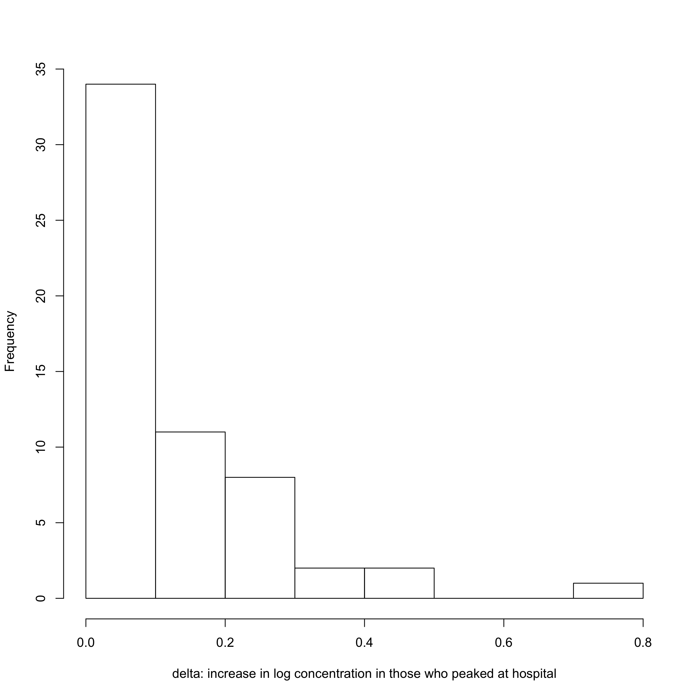
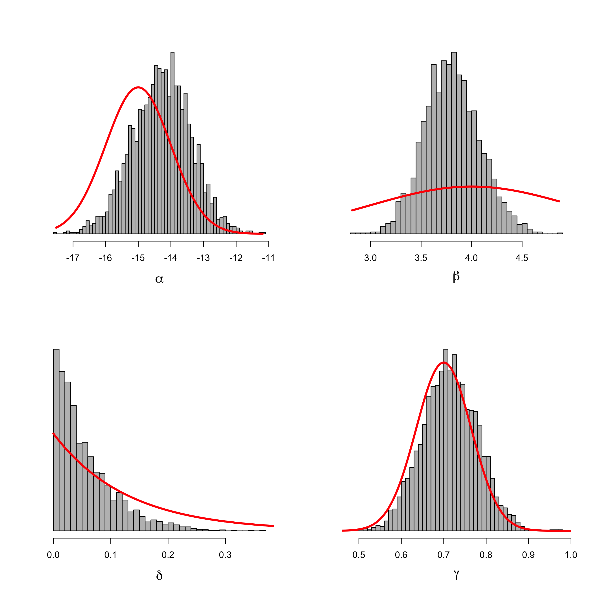
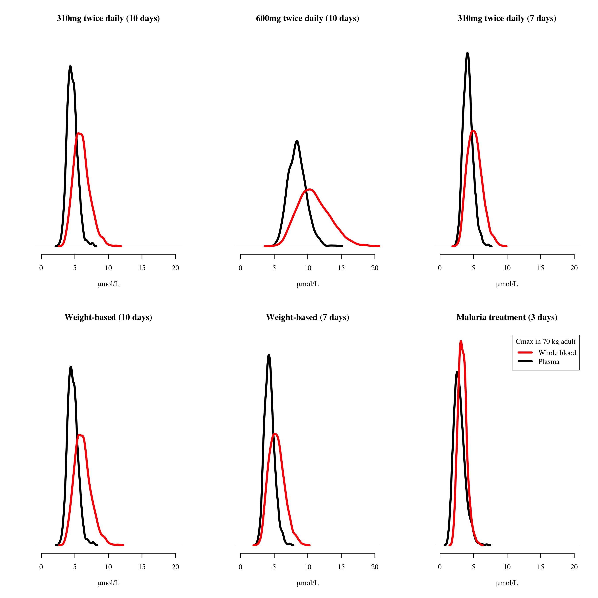
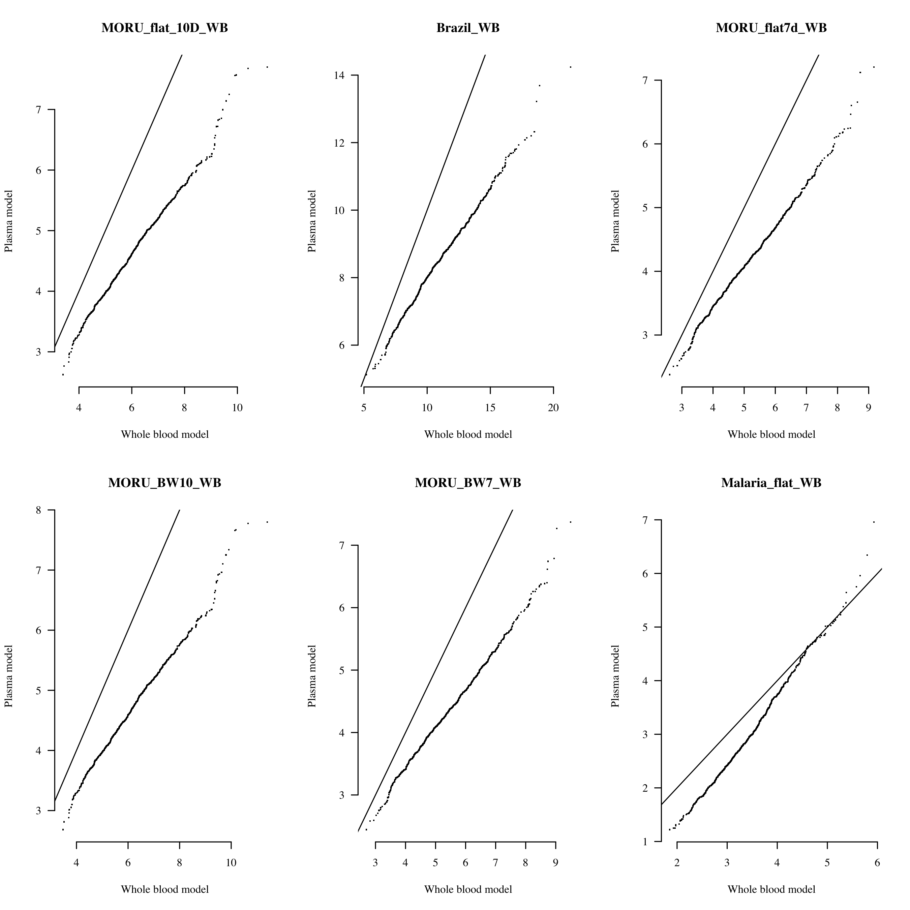
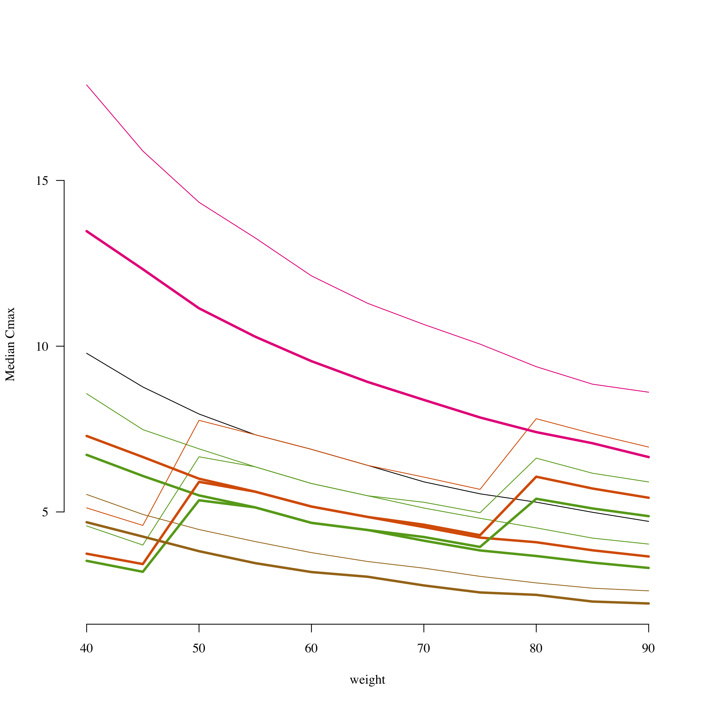
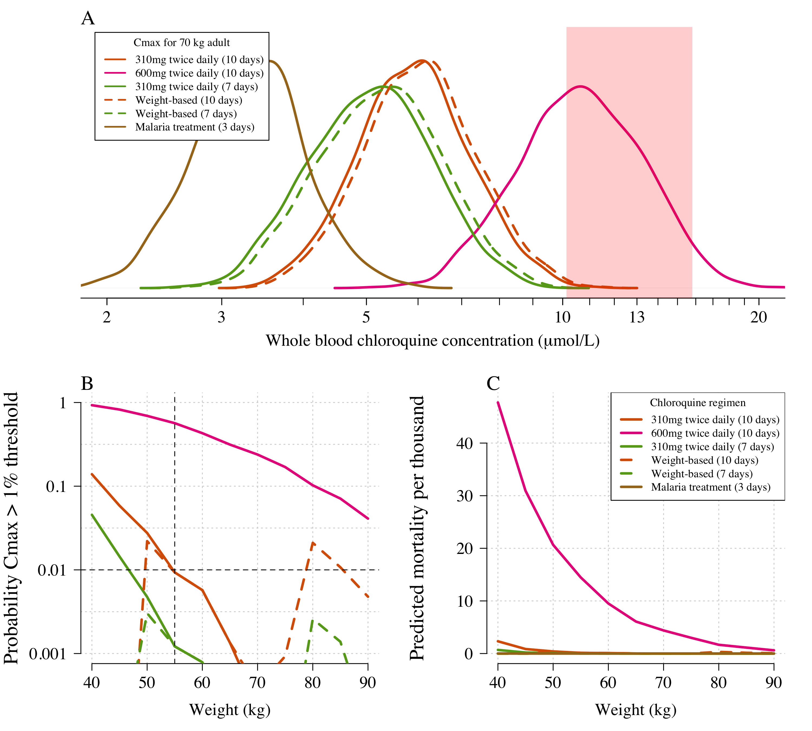
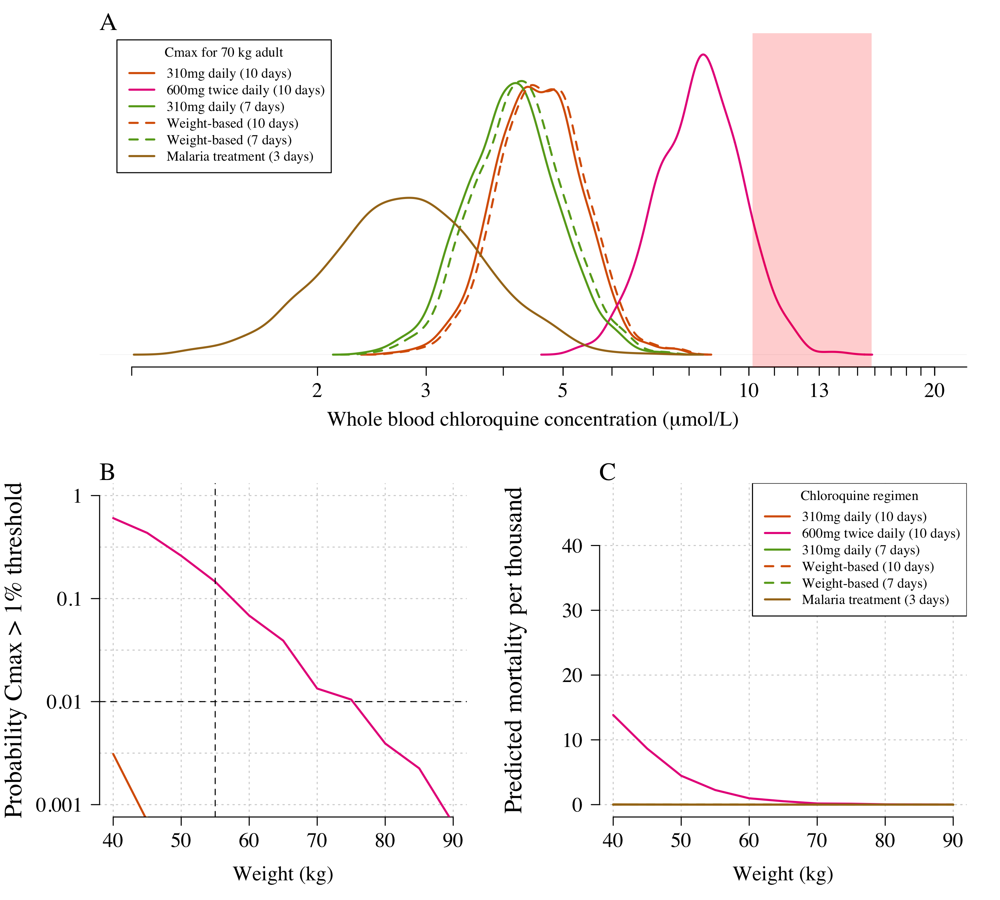
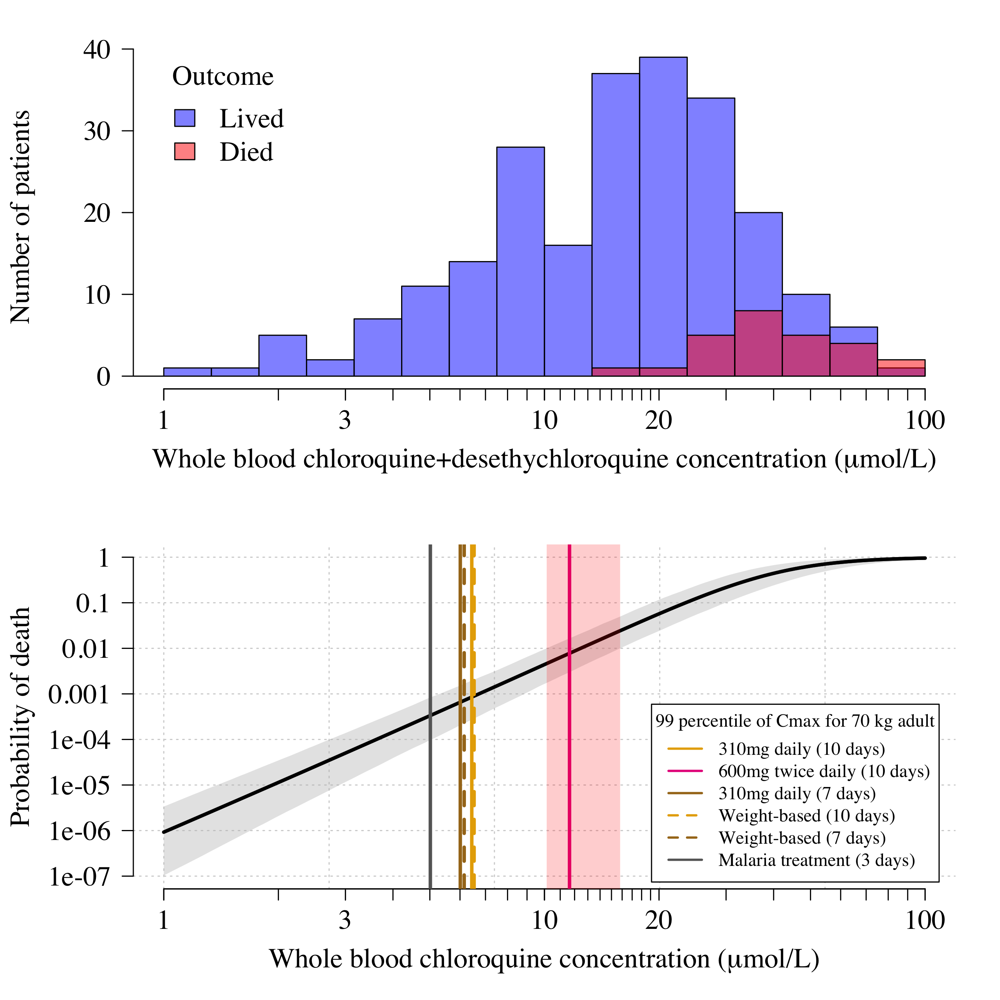

## Data from self-poisoning cohorts

Data from Riou were extracted from published graph (see Figure 3 in NEJM Riou et al, 1988) using WebPlotDigitiser


```r
pooled_data = read.csv('Pooled_data.csv')
```

#### Comparing retrospective and prospective dat

We use simple logistic regression on admission concentrations to demonstrate significant differences between the retrospective and prospective data

```r
par(las=1, family='serif', bty='n')
ind_pros = pooled_data$Prospective=='Yes'
mod_pros = glm(Outcome ~ log(CQumolL_Admission), data = pooled_data[ind_pros,], family='binomial')
mod_retro = glm(Outcome ~ log(CQumolL_Admission), data = pooled_data[!ind_pros,], family='binomial')
summary(mod_pros)
```

```
## 
## Call:
## glm(formula = Outcome ~ log(CQumolL_Admission), family = "binomial", 
##     data = pooled_data[ind_pros, ])
## 
## Deviance Residuals: 
##      Min        1Q    Median        3Q       Max  
## -1.43214  -0.43250  -0.25157  -0.09685   2.64265  
## 
## Coefficients:
##                        Estimate Std. Error z value Pr(>|z|)    
## (Intercept)            -10.1578     1.7089  -5.944 2.78e-09 ***
## log(CQumolL_Admission)   2.4434     0.4791   5.100 3.39e-07 ***
## ---
## Signif. codes:  0 '***' 0.001 '**' 0.01 '*' 0.05 '.' 0.1 ' ' 1
## 
## (Dispersion parameter for binomial family taken to be 1)
## 
##     Null deviance: 168.62  on 257  degrees of freedom
## Residual deviance: 126.63  on 256  degrees of freedom
## AIC: 130.63
## 
## Number of Fisher Scoring iterations: 6
```

```r
summary(mod_retro)
```

```
## 
## Call:
## glm(formula = Outcome ~ log(CQumolL_Admission), family = "binomial", 
##     data = pooled_data[!ind_pros, ])
## 
## Deviance Residuals: 
##      Min        1Q    Median        3Q       Max  
## -1.68864  -0.44760   0.07944   0.15000   1.98898  
## 
## Coefficients:
##                        Estimate Std. Error z value Pr(>|z|)    
## (Intercept)            -10.6622     2.5628  -4.160 3.18e-05 ***
## log(CQumolL_Admission)   3.7366     0.9055   4.126 3.68e-05 ***
## ---
## Signif. codes:  0 '***' 0.001 '**' 0.01 '*' 0.05 '.' 0.1 ' ' 1
## 
## (Dispersion parameter for binomial family taken to be 1)
## 
##     Null deviance: 125.614  on 90  degrees of freedom
## Residual deviance:  45.342  on 89  degrees of freedom
## AIC: 49.342
## 
## Number of Fisher Scoring iterations: 7
```

```r
coef(mod_pros)
```

```
##            (Intercept) log(CQumolL_Admission) 
##             -10.157780               2.443373
```

```r
coef(mod_retro)
```

```
##            (Intercept) log(CQumolL_Admission) 
##              -10.66220                3.73664
```

```r
plot(1:100, predict(mod_pros, newdata = data.frame(CQumolL_Admission=1:100),type='response'),type='l',
     ylim=c(0,1),lwd=3, xlab='Chloroquine concentration (umol/L)',
      ylab='Probability of death', panel.first=grid())
lines(1:100, predict(mod_retro, newdata = data.frame(CQumolL_Admission=1:100),type='response'),
      col='blue',lwd=3,lty=2)
legend('bottomright', lwd=3, legend = c('Prospective data','Retrospective data'),col=c(1,4),
       inset=0.03, lty=1:2)
```

<!-- -->


#### Estimating delta increase in those with observed peak

We only use prospectively studied patients - the retrospectively studied patients have quite a different concentration-fatality profile.


```r
pooled_data = dplyr::filter(pooled_data, Prospective=='Yes')
ind_increase = which(!is.na(pooled_data$CQumolL_Peak) &
                       pooled_data$CQumolL_Peak>pooled_data$CQumolL_Admission)
writeLines(sprintf('%s patients had their peak observed in hospital', length(ind_increase)))
```

```
## 58 patients had their peak observed in hospital
```

```r
hist(log10(pooled_data$CQumolL_Peak[ind_increase])-
       log10(pooled_data$CQumolL_Admission[ind_increase]), main='', xlab='delta: increase in log concentration in those who peaked at hospital')
```

<!-- -->

## Stan model


```r
logistic_model = '
data {
   int<lower=0> N_admission;
   int<lower=0> N_peak;
   vector[N_admission] log_conc_admission;
   vector[N_peak] log_conc_peak;
   int<lower=0,upper=1> y_admission[N_admission];
   int<lower=0,upper=1> y_peak[N_peak];
   // Prior parameters
   real mean_alpha;
   real sd_alpha;
   real mean_beta;
   real sd_beta;
}
parameters {
   real alpha; // Intercept term in logistic regression
   real beta;  // Concentration coefficient in logistic regression
   real<lower=0> delta; // Mean increase in chloroquine concentrations on the log scale
   real<lower=0,upper=1> gamma; // Fraction of chloroquine in measured concentration
}
model {
  //Prior
  alpha ~ normal(mean_alpha,sd_alpha);
  beta ~ normal(mean_beta,sd_beta);
  gamma ~ normal(0.7, 0.065); // Prior is estimated from a large CQ&DCQ dataset
  delta ~ exponential(7.8); // rate parameter estimated from the observed peak vs admission
  // Likelihood
  y_peak ~ bernoulli_logit(alpha + beta * (log(gamma * (exp(log_conc_peak)))));
  y_admission ~ bernoulli_logit(alpha + beta * (log(gamma * (exp(log_conc_admission))) + delta));
}
'
if(RUN_MODELS) log_reg = stan_model(model_code = logistic_model)
```

## Fit main model to prospective data


```r
load('mod_full.stanout')
thetas = extract(mod_full)
par(mfrow=c(2,2),las=1, cex.lab=1.5)
hist(thetas$alpha, freq = F,breaks = 50,main = '', xlab = expression(alpha), col = 'grey',
     ylab='', yaxt='n')
xs = seq(min(thetas$alpha), max(thetas$alpha), length.out=500)
lines(xs, dnorm(xs, mean = prior_params$mean_alpha, sd = prior_params$sd_alpha), lwd=3, col='red')
hist(thetas$beta,freq=F,breaks = 50,main = '', xlab = expression(beta), col = 'grey',
     ylab='', yaxt='n')
xs = seq(min(thetas$beta), max(thetas$beta), length.out=500)
lines(xs, dnorm(xs, mean = prior_params$mean_beta, sd = prior_params$sd_beta), lwd=3, col='red')

hist(thetas$delta, freq=F,breaks = 50,main = '', xlab = expression(delta), col = 'grey',
     ylab='', yaxt='n')
xs=seq(0,2,length.out = 2000); lines(xs, dexp(xs,rate=7.8),col='red',lwd=3)

hist(thetas$gamma, freq=F,breaks = 50,main = '', xlab = expression(gamma), col = 'grey',
     ylab='', yaxt='n')
xs=seq(0,1,length.out = 500); lines(xs, dnorm(xs,mean=0.7, sd=0.065),col='red',lwd=3)
```

<!-- -->


```r
K = length(thetas$alpha)
OnePercent = array(dim=K)
xs = seq(0, log(100), length.out = 200)
Pred_mortality = array(dim=c(K, 200))
for(k in 1:K){
  OnePercent[k] = exp((logit(0.01) - thetas$alpha[k])/thetas$beta[k])
  Pred_mortality[k, ] = inv.logit(thetas$alpha[k] + thetas$beta[k] * xs)
}

plot(density(OnePercent),xlab='Chloroquine concentration in whole blood (umol/L)', 
     main = 'Concentration that gives 1% mortality', yaxt='n', ylab='', bty='n',lwd=3)
abline(v=quantile(OnePercent, probs = c(0.025, 0.975)),lty=2)
```

<!-- -->

```r
print(quantile(OnePercent, probs = c(0.025, 0.975)))
```

```
##     2.5%    97.5% 
## 10.13679 15.80704
```

# Pharmacokinetic models output


```r
load('Population_Cmax_values.RData')

# plasma model
ind_plasma = grep(pattern = 'plasma', x = unlist(dimnames(Cmax_pop)[1]))
# whole blood model
ind_WB = grep(pattern = 'WB', x = unlist(dimnames(Cmax_pop)[1]))
Cmax_pop[ind_plasma,,,] = Cmax_pop[ind_plasma,,,]*plasma_to_whole_blood_ratio
cols = brewer.pal(8, name = 'Dark2')[c(2,4,5,7)]
cols = c(cols[1], cols[2], cols[3],cols[1],cols[3],cols[4])
cols=c(cols,cols)
cnames = unlist(dimnames(Cmax_pop)[1])

legend_names = c('310mg twice daily (10 days)','600mg twice daily (10 days)',
                 '310mg twice daily (7 days)', 
                 'Weight-based (10 days)','Weight-based (7 days)',
                 'Malaria treatment (3 days)')

par(mfrow=c(2,3),bty='n',las=1, family='serif')
ws = grep(pattern = Weight_interested, x = unlist(dimnames(Cmax_pop)[2]))
for(i in 1:length(ind_plasma)){
  plot(density(Cmax_pop[ind_plasma[i],ws,,1]), main=legend_names[i], ylim=c(0,0.6),
       xlab=expression(mu*'mol/L'), ylab='', yaxt='n', xlim=c(0,20),lwd=3)
  lines(density(Cmax_pop[ind_WB[i],ws,,1]),col='red',lwd=3)
  writeLines(sprintf('Median cmax for regimen %s is %s under whole blood model and %s under plasma model',
                     cnames[i], round(median(Cmax_pop[ind_WB[i],ws,,1]),1),
                     round(median(Cmax_pop[ind_plasma[i],ws,,1],1))))
}
```

```
## Median cmax for regimen MORU_flat_10D_WB is 5.9 under whole blood model and 5 under plasma model
```

```
## Median cmax for regimen Brazil_WB is 10.7 under whole blood model and 8 under plasma model
```

```
## Median cmax for regimen MORU_flat7d_WB is 5.1 under whole blood model and 4 under plasma model
```

```
## Median cmax for regimen MORU_BW10_WB is 6.1 under whole blood model and 5 under plasma model
```

```
## Median cmax for regimen MORU_BW7_WB is 5.3 under whole blood model and 4 under plasma model
```

```
## Median cmax for regimen Malaria_flat_WB is 3.3 under whole blood model and 3 under plasma model
```

```r
legend('topright',title = paste('Cmax in',Weight_interested,'kg adult'), col=2:1, 
       lwd=3, legend = c('Whole blood','Plasma'))
```

<!-- -->

```r
for(i in 1:length(ind_plasma)){
  qqplot(Cmax_pop[ind_WB[i],ws,,1], Cmax_pop[ind_plasma[i],ws,,1], main=cnames[i], 
         xlab='Whole blood model', ylab='Plasma model', pch='.')
  lines(0:100,0:100)
}
```

<!-- -->

```r
median_cmax = array(dim = c(dim(Cmax_pop)[1], dim(Cmax_pop)[2]))
for(i in 1:dim(Cmax_pop)[1]){
  for(j in 1:dim(Cmax_pop)[2]){
    median_cmax[i,j] = median(Cmax_pop[i,j,,1])
  }
}
par(mfrow=c(1,1),bty='n',las=1, family='serif')
plot(seq(40,90, by=5), median_cmax[1,],type='l', ylim=range(median_cmax),xlab='weight', ylab='Median Cmax')
for(i in 2:dim(Cmax_pop)[1]){
  if(i > 6) lwds=3 else lwds = 1
  lines(seq(40,90, by=5), median_cmax[i,], col=cols[i],lwd=lwds)
}
```

<!-- -->


```r
q = 1
uCI_mortality_per_thousand = 
  lCI_mortality_per_thousand = 
  mean_mortality_per_thousand = 
  above_threshold = array(dim = c(dim(Cmax_pop)[1], 11))

colnames(uCI_mortality_per_thousand)=
  colnames(lCI_mortality_per_thousand)=
  colnames(mean_mortality_per_thousand)=
  colnames(above_threshold)= unlist(dimnames(Cmax_pop)[2])
rownames(uCI_mortality_per_thousand)=
  rownames(lCI_mortality_per_thousand)=
  rownames(mean_mortality_per_thousand)=
  rownames(above_threshold)= unlist(dimnames(Cmax_pop)[1])

for(i in 1:dim(Cmax_pop)[1]){
  Cmax_pop_fs = Cmax_pop[i,,,q]
  above_one_percent = ps = array(dim=c(11,K))
  
  for(w in 1:11){
    for(k in 1:K){
      cqs = Cmax_pop_fs[w,]
      cqs = cqs[!is.na(cqs)]
      
      danger_threshold = exp((logit(0.01)-thetas$alpha[k])/thetas$beta[k])
      ind_above = cqs > danger_threshold
      above_one_percent[w,k] = mean(ind_above)
      
      if(mean(ind_above)>0){
        mean_mortality = mean(inv.logit(thetas$alpha[k] + 
                                          thetas$beta[k]*log(cqs[ind_above])), na.rm=T)
        ps[w,k] = mean_mortality * mean(ind_above)
      } else {
        ps[w,k] = 0
      }
    }
  }
  above_threshold[i, ] = rowMeans(above_one_percent)*100
  mean_mortality_per_thousand[i,] = rowMeans(ps)*1000
  uCI_mortality_per_thousand[i,] = apply(ps,1,quantile,probs=0.975)*1000
  lCI_mortality_per_thousand[i,] = apply(ps,1,quantile,probs=0.025)*1000
}
```


Hoglund et al malaria patient whole blood model: predictions for Cmax greater than threshold and per thousand mortality

```r
# Set the indices to the simulations from the whole blood model
ind_model = ind_WB

ltys = rep(c(1,1,1,2,2,1),2)
lwds = c(rep(3,6), rep(2,6))
tick_points = c(1:19,seq(20,100,by=10))
x_points = c(2,3,5,10,13,20)

par(las=1, bty='n', family = 'serif',cex.lab=1.5, cex.axis=1.5,mar=c(5,6,2,2))
layout(mat = matrix(c(1,1,2,3), nrow = 2, byrow = T))

plot(density(log(Cmax_pop[ind_model[1],ws,,q]),na.rm=T), xlim = log(c(2, 20)),ylab='',yaxt='n', 
     xaxt='n', main='',col=cols[ind_model[1]],lwd=lwds[ind_model[1]], ylim=c(0,2.2),
     xlab = expression(paste('Whole blood chloroquine concentration (',mu,'mol/L)')))
for(i in ind_model[-1]){
  lines(density(log(Cmax_pop[i,ws,,q]),na.rm=T), lwd=lwds[i],col=cols[i],lty=ltys[i])
}
axis(1, at=log(x_points),labels = x_points)
axis(1, at = log(tick_points), labels = NA, tick = T)
legend('topleft',legend = legend_names,bg = 'white',col=cols[ind_model],
       lwd=2,inset=0.02,lty=ltys[ind_model],
       title = paste('Cmax for', Weight_interested,'kg adult'))
qs=quantile(OnePercent, probs = c(0.025,0.975))
polygon(x = log(c(qs,rev(qs))), y = c(-9,-9,10,10), 
        col = adjustcolor('red',alpha.f = .2),border = NA)
mtext(text = 'A',side = 3,cex=1.5,adj = 0)

## Probability of being above threshold
plot(seq(40,90,by=5), log10(above_threshold[ind_model[1], ]/100), type='l',main='',
     ylim=c(-3,0),col=cols[ind_model[1]],lwd=lwds[ind_model[1]],
     panel.first = grid(), xlab='Weight (kg)',yaxt='n',ylab='')
for(i in ind_model[-1]){
  ind = !is.infinite(log10(above_threshold[i, ]/100))
  lines(seq(40,90,by=5)[ind], log10(above_threshold[i,ind]/100),lwd=lwds[i],col=cols[i],lty=ltys[i])
}
axis(2, at = -3:0, labels = 10^(-3:0))
abline(h = -2, v=55, lty=2)
mtext(text = 'Probability Cmax > 1% threshold',side = 2,line = 4.5,las=3,cex=1.5)
mtext(text = 'B',side = 3,cex=1.5,adj = 0)


## Probability of being above threshold
plot(seq(40,90,by=5), mean_mortality_per_thousand[ind_model[1], ], type='l',main='',
     col=cols[ind_model[1]],lwd=lwds[ind_model[1]],xlab='Weight (kg)',ylab='',
     ylim=range(mean_mortality_per_thousand), panel.first = grid())
for(i in ind_model[-1]){
  lines(seq(40,90,by=5),  mean_mortality_per_thousand[i,],lwd=lwds[i],col=cols[i],lty=ltys[i])
}
legend('topright',col = cols[ind_model], title = 'Chloroquine regimen',
       legend = legend_names, lwd=lwds[ind_model], lty=ltys[ind_model])
mtext(text = 'Predicted mortality per thousand',side = 2,line = 4.5,las=3,cex=1.5)
mtext(text = 'C',side = 3,cex=1.5,adj = 0)
```

<!-- -->


```r
x_points = c(1,3,10,20,100)

par(mfrow=c(2,1),las=1, cex.lab=1.5, cex.axis=1.5, family='serif',bty='n',mar=c(5,6,2,2))
hist(log10(pooled_data$CQumolL_Admission[pooled_data$Outcome==0]), xlim = log10(c(1,100)),
     main='', breaks = seq(-1.25,2,by=.25/2),ylab='',
     xaxt='n',
     xlab = expression(paste('Whole blood chloroquine+desethychloroquine concentration (',mu,'mol/L)')), 
     col=adjustcolor('blue',alpha.f = .5))
hist(log10(pooled_data$CQumolL_Admission[pooled_data$Outcome==1]), 
     breaks = seq(-1,2,by=.25/2), add=T, col=adjustcolor('red',alpha.f = .5))
mtext(text = 'Number of patients',side = 2,line = 4.5,las=3,cex=1.5)
legend('topleft',  fill=adjustcolor(c('blue','red'),alpha.f = .5),
       legend = c('Lived','Died'),inset=0.02, cex=1.5, bty='n',title = 'Outcome')
axis(1, at=log10(x_points),labels = x_points)
axis(1, at = log10(tick_points), labels = NA, tick = T)

plot(xs, log10(colMeans(Pred_mortality)), type = 'l', ylim = c(-7,0),lwd=3, 
     xlab = expression(paste('Whole blood chloroquine concentration (',mu,'mol/L)')), yaxt='n',
     xlim = log(c(1,100)),ylab = '',xaxt='n',panel.first = grid())
mtext(text = 'Probability of death',side = 2,line = 4.5,las=3,cex=1.5)
polygon(c(xs, rev(xs)), 
        log10(c(apply(Pred_mortality,2,quantile, probs=0.025),
                rev(apply(Pred_mortality,2,quantile, probs=0.975)))),
        col = adjustcolor('grey',alpha.f = .4),border = NA)
lines(xs, log10(colMeans(Pred_mortality)), lwd=3)
axis(1, at=log(x_points),labels = x_points)
axis(1, at = log(tick_points), labels = NA, tick = T)
axis(2, at = -7:0, labels = 10^(-7:0))
for(i in ind_model){
  abline(v = log(quantile(Cmax_pop[i,ws,,2], probs = 0.99,na.rm=T)), col=cols[i],lwd=3,lty=ltys[i])
  print(quantile(Cmax_pop[i,6,,1], probs = 0.99,na.rm=T))
}
```

```
##      99% 
## 10.36903 
##     99% 
## 17.7724 
##      99% 
## 9.091903 
##      99% 
## 10.36903 
##      99% 
## 9.091903 
##      99% 
## 5.324716
```

```r
legend('bottomright',legend = legend_names,col=cols[ind_model],lwd=2,inset=0.02,lty=ltys,
       title = paste('99 percentile of Cmax for',Weight_interested,'kg adult'))
qs=quantile(OnePercent, probs = c(0.025,0.975))
polygon(x = log(c(qs,rev(qs))), y = c(-9,-9,1,1), col = adjustcolor('red',alpha.f = .2),border = NA)
```

<!-- -->

Mortality per thousand across the weight categories

```r
writeLines('Mean predicted mortality')
```

```
## Mean predicted mortality
```

```r
knitr::kable(round(mean_mortality_per_thousand,1))
```

                          40     45     50     55    60    65    70    75    80    85    90
---------------------  -----  -----  -----  -----  ----  ----  ----  ----  ----  ----  ----
MORU_flat_10D_WB         2.3    0.9    0.4    0.1   0.1   0.0   0.0   0.0   0.0   0.0   0.0
Brazil_WB               47.7   30.9   20.7   14.5   9.5   6.1   4.4   3.0   1.7   1.1   0.6
MORU_flat7d_WB           0.7    0.2    0.1    0.0   0.0   0.0   0.0   0.0   0.0   0.0   0.0
MORU_BW10_WB             0.0    0.0    0.3    0.1   0.1   0.0   0.0   0.0   0.3   0.1   0.1
MORU_BW7_WB              0.0    0.0    0.0    0.0   0.0   0.0   0.0   0.0   0.0   0.0   0.0
Malaria_flat_WB          0.0    0.0    0.0    0.0   0.0   0.0   0.0   0.0   0.0   0.0   0.0
MORU_flat_10D_plasma     0.0    0.0    0.0    0.0   0.0   0.0   0.0   0.0   0.0   0.0   0.0
Brazil_plasma           13.8    8.7    4.5    2.3   1.0   0.5   0.2   0.1   0.1   0.0   0.0
MORU_flat7d_plasma       0.0    0.0    0.0    0.0   0.0   0.0   0.0   0.0   0.0   0.0   0.0
MORU_BW10_plasma         0.0    0.0    0.0    0.0   0.0   0.0   0.0   0.0   0.0   0.0   0.0
MORU_BW7_plasma          0.0    0.0    0.0    0.0   0.0   0.0   0.0   0.0   0.0   0.0   0.0
Malaria_flat_plasma      0.0    0.0    0.0    0.0   0.0   0.0   0.0   0.0   0.0   0.0   0.0

```r
writeLines('Upper 95 CI of predicted mortality')
```

```
## Upper 95 CI of predicted mortality
```

```r
knitr::kable(round(uCI_mortality_per_thousand,1))
```

                          40     45     50     55     60     65     70     75    80    85    90
---------------------  -----  -----  -----  -----  -----  -----  -----  -----  ----  ----  ----
MORU_flat_10D_WB         8.6    4.2    2.1    0.9    0.5    0.1    0.0    0.0   0.0   0.0   0.0
Brazil_WB               96.6   64.8   45.4   33.9   24.7   17.7   13.6   10.1   6.5   4.6   3.0
MORU_flat7d_WB           3.4    1.2    0.4    0.1    0.0    0.0    0.0    0.0   0.0   0.0   0.0
MORU_BW10_WB             0.0    0.0    1.7    0.9    0.5    0.1    0.0    0.1   1.6   0.9   0.4
MORU_BW7_WB              0.0    0.0    0.3    0.1    0.0    0.0    0.0    0.0   0.2   0.1   0.0
Malaria_flat_WB          0.0    0.0    0.0    0.0    0.0    0.0    0.0    0.0   0.0   0.0   0.0
MORU_flat_10D_plasma     0.3    0.1    0.0    0.0    0.0    0.0    0.0    0.0   0.0   0.0   0.0
Brazil_plasma           33.3   23.7   15.2    9.6    5.6    3.3    1.4    0.9   0.4   0.2   0.1
MORU_flat7d_plasma       0.1    0.0    0.0    0.0    0.0    0.0    0.0    0.0   0.0   0.0   0.0
MORU_BW10_plasma         0.0    0.0    0.0    0.0    0.0    0.0    0.0    0.0   0.0   0.0   0.0
MORU_BW7_plasma          0.0    0.0    0.0    0.0    0.0    0.0    0.0    0.0   0.0   0.0   0.0
Malaria_flat_plasma      0.0    0.0    0.0    0.0    0.0    0.0    0.0    0.0   0.0   0.0   0.0

```r
writeLines('Lower 95 CI of predicted mortality')
```

```
## Lower 95 CI of predicted mortality
```

```r
knitr::kable(round(lCI_mortality_per_thousand,1))
```

                          40     45    50    55    60    65    70    75    80   85   90
---------------------  -----  -----  ----  ----  ----  ----  ----  ----  ----  ---  ---
MORU_flat_10D_WB         0.1    0.0   0.0   0.0   0.0   0.0   0.0   0.0   0.0    0    0
Brazil_WB               18.7   10.8   5.9   3.4   1.6   0.7   0.4   0.2   0.1    0    0
MORU_flat7d_WB           0.0    0.0   0.0   0.0   0.0   0.0   0.0   0.0   0.0    0    0
MORU_BW10_WB             0.0    0.0   0.0   0.0   0.0   0.0   0.0   0.0   0.0    0    0
MORU_BW7_WB              0.0    0.0   0.0   0.0   0.0   0.0   0.0   0.0   0.0    0    0
Malaria_flat_WB          0.0    0.0   0.0   0.0   0.0   0.0   0.0   0.0   0.0    0    0
MORU_flat_10D_plasma     0.0    0.0   0.0   0.0   0.0   0.0   0.0   0.0   0.0    0    0
Brazil_plasma            2.6    1.1   0.2   0.1   0.0   0.0   0.0   0.0   0.0    0    0
MORU_flat7d_plasma       0.0    0.0   0.0   0.0   0.0   0.0   0.0   0.0   0.0    0    0
MORU_BW10_plasma         0.0    0.0   0.0   0.0   0.0   0.0   0.0   0.0   0.0    0    0
MORU_BW7_plasma          0.0    0.0   0.0   0.0   0.0   0.0   0.0   0.0   0.0    0    0
Malaria_flat_plasma      0.0    0.0   0.0   0.0   0.0   0.0   0.0   0.0   0.0    0    0

```r
writeLines('Proportion of Cmax above 10umol/L')
```

```
## Proportion of Cmax above 10umol/L
```

```r
knitr::kable(round(100*apply(Cmax_pop[,,,1] > 10, c(1,2), mean),1))
```

                          40     45     50     55     60     65     70     75     80     85     90
---------------------  -----  -----  -----  -----  -----  -----  -----  -----  -----  -----  -----
MORU_flat_10D_WB        46.7   26.9   14.3    7.0    3.7    1.4    0.2    0.4    0.3    0.0    0.0
Brazil_WB               99.9   98.1   96.1   91.5   83.3   74.3   61.7   51.1   37.1   27.6   20.4
MORU_flat7d_WB          22.1    8.9    3.0    0.8    0.6    0.3    0.0    0.0    0.0    0.0    0.0
MORU_BW10_WB             0.1    0.0   11.7    7.0    3.7    1.4    0.4    0.5   10.9    7.6    3.7
MORU_BW7_WB              0.0    0.0    2.0    0.8    0.6    0.3    0.0    0.0    1.9    1.0    0.1
Malaria_flat_WB          0.2    0.0    0.0    0.0    0.0    0.0    0.0    0.0    0.0    0.0    0.0
MORU_flat_10D_plasma     2.7    0.7    0.2    0.0    0.0    0.0    0.0    0.0    0.0    0.0    0.0
Brazil_plasma           96.3   89.8   75.0   56.2   39.2   24.8   11.5    7.4    3.6    2.1    0.5
MORU_flat7d_plasma       0.8    0.1    0.0    0.1    0.0    0.0    0.0    0.0    0.0    0.0    0.0
MORU_BW10_plasma         0.0    0.0    0.2    0.0    0.0    0.0    0.0    0.0    0.2    0.1    0.0
MORU_BW7_plasma          0.0    0.0    0.0    0.1    0.0    0.0    0.0    0.0    0.0    0.0    0.0
Malaria_flat_plasma      0.3    0.3    0.0    0.0    0.0    0.0    0.0    0.0    0.0    0.0    0.0


## Supplementary: Plasma PK model predictionsm


```r
writeLines(sprintf('Using a blood to plasma ratio of %s', plasma_to_whole_blood_ratio))
```

```
## Using a blood to plasma ratio of 3
```


Healthy volunteer model based on plasma measurements: predictions for Cmax greater than threshold and per thousand mortality

```r
# Set the indices to the simulations from the whole blood model
ind_model = ind_plasma

ltys = rep(c(1,1,1,2,2,1),2)
lwds = c(rep(3,6), rep(2,6))
tick_points = c(1:19,seq(20,100,by=10))
x_points = c(2,3,5,10,13,20)
legend_names = c('310mg daily (10 days)','600mg twice daily (10 days)',
                 '310mg daily (7 days)', 
                 'Weight-based (10 days)','Weight-based (7 days)',
                 'Malaria treatment (3 days)')
par(las=1, bty='n', family = 'serif',cex.lab=1.5, cex.axis=1.5,mar=c(5,6,2,2))
layout(mat = matrix(c(1,1,2,3), nrow = 2, byrow = T))

plot(density(log(Cmax_pop[ind_model[1],ws,,q]),na.rm=T), xlim = log(c(1, 20)),ylab='',yaxt='n', 
     xaxt='n', main='',col=cols[ind_model[1]],lwd=lwds[ind_model[1]], ylim=c(0,2.7),
     xlab = expression(paste('Whole blood chloroquine concentration (',mu,'mol/L)')))
for(i in ind_model[-1]){
  lines(density(log(Cmax_pop[i,ws,,q]),na.rm=T), lwd=lwds[i],col=cols[i],lty=ltys[i])
}
axis(1, at=log(x_points),labels = x_points)
axis(1, at = log(tick_points), labels = NA, tick = T)
legend('topleft',legend = legend_names,bg = 'white',col=cols[ind_model],
       lwd=2,inset=0.02,lty=ltys[ind_model],
       title = paste('Cmax for', Weight_interested,'kg adult'))
qs=quantile(OnePercent, probs = c(0.025,0.975))
polygon(x = log(c(qs,rev(qs))), y = c(-9,-9,10,10), 
        col = adjustcolor('red',alpha.f = .2),border = NA)
mtext(text = 'A',side = 3,cex=1.5,adj = 0)

## Probability of being above threshold
plot(seq(40,90,by=5), log10(above_threshold[ind_model[1], ]/100), type='l',main='',
     ylim=c(-3,0),col=cols[ind_model[1]],lwd=lwds[ind_model[1]],
     panel.first = grid(), xlab='Weight (kg)',yaxt='n',ylab='')
for(i in ind_model[-1]){
  ind = !is.infinite(log10(above_threshold[i, ]/100))
  lines(seq(40,90,by=5)[ind], log10(above_threshold[i,ind]/100),lwd=lwds[i],col=cols[i],lty=ltys[i])
}
axis(2, at = -3:0, labels = 10^(-3:0))
abline(h = -2, v=55, lty=2)
mtext(text = 'Probability Cmax > 1% threshold',side = 2,line = 4.5,las=3,cex=1.5)
mtext(text = 'B',side = 3,cex=1.5,adj = 0)


## Probability of being above threshold
plot(seq(40,90,by=5), mean_mortality_per_thousand[ind_model[1], ], type='l',main='',
     col=cols[ind_model[1]],lwd=lwds[ind_model[1]],xlab='Weight (kg)',ylab='',
     ylim=range(mean_mortality_per_thousand),panel.first = grid())
for(i in ind_model[-1]){
  lines(seq(40,90,by=5),  mean_mortality_per_thousand[i,],lwd=lwds[i],col=cols[i],lty=ltys[i])
}
legend('topright',col = cols[ind_model], title = 'Chloroquine regimen',
       legend = legend_names, lwd=lwds[ind_model], lty=ltys[ind_model])
mtext(text = 'Predicted mortality per thousand',side = 2,line = 4.5,las=3,cex=1.5)
mtext(text = 'C',side = 3,cex=1.5,adj = 0)
```

<!-- -->


```r
x_points = c(1,3,10,20,100)

par(mfrow=c(2,1),las=1, cex.lab=1.5, cex.axis=1.5, family='serif',bty='n',mar=c(5,6,2,2))
hist(log10(pooled_data$CQumolL_Admission[pooled_data$Outcome==0]), xlim = log10(c(1,100)),
     main='', breaks = seq(-1.25,2,by=.25/2),ylab='',
     xaxt='n',
     xlab = expression(paste('Whole blood chloroquine+desethychloroquine concentration (',mu,'mol/L)')), 
     col=adjustcolor('blue',alpha.f = .5))
hist(log10(pooled_data$CQumolL_Admission[pooled_data$Outcome==1]), 
     breaks = seq(-1,2,by=.25/2), add=T, col=adjustcolor('red',alpha.f = .5))
mtext(text = 'Number of patients',side = 2,line = 4.5,las=3,cex=1.5)
legend('topleft',  fill=adjustcolor(c('blue','red'),alpha.f = .5),
       legend = c('Lived','Died'),inset=0.02, cex=1.5, bty='n',title = 'Outcome')
axis(1, at=log10(x_points),labels = x_points)
axis(1, at = log10(tick_points), labels = NA, tick = T)

plot(xs, log10(colMeans(Pred_mortality)), type = 'l', ylim = c(-7,0),lwd=3, 
     xlab = expression(paste('Whole blood chloroquine concentration (',mu,'mol/L)')), yaxt='n',
     xlim = log(c(1,100)),ylab = '',xaxt='n',panel.first = grid())
mtext(text = 'Probability of death',side = 2,line = 4.5,las=3,cex=1.5)
polygon(c(xs, rev(xs)), 
        log10(c(apply(Pred_mortality,2,quantile, probs=0.025),
                rev(apply(Pred_mortality,2,quantile, probs=0.975)))),
        col = adjustcolor('grey',alpha.f = .4),border = NA)
lines(xs, log10(colMeans(Pred_mortality)), lwd=3)
axis(1, at=log(x_points),labels = x_points)
axis(1, at = log(tick_points), labels = NA, tick = T)
axis(2, at = -7:0, labels = 10^(-7:0))
for(i in ind_model){
  abline(v = log(quantile(Cmax_pop[i,ws,,2], probs = 0.99,na.rm=T)), col=cols[i],lwd=3,lty=ltys[i])
  print(quantile(Cmax_pop[i,6,,1], probs = 0.99,na.rm=T))
}
```

```
##      99% 
## 6.735651 
##      99% 
## 12.94727 
##      99% 
## 6.513993 
##      99% 
## 6.735651 
##      99% 
## 6.513993 
##      99% 
## 5.789511
```

```r
legend('bottomright',legend = legend_names,col=cols[ind_model],lwd=2,inset=0.02,lty=ltys,
       title = paste('99 percentile of Cmax for', Weight_interested,'kg adult'))
qs=quantile(OnePercent, probs = c(0.025,0.975))
polygon(x = log(c(qs,rev(qs))), y = c(-9,-9,1,1), col = adjustcolor('red',alpha.f = .2),border = NA)
```

<!-- -->
