## Data


```r
pooled_data = read.csv('Pooled_data.csv')
```

## Stan model


```r
if(RUN_MODELS){
  logistic_model = '
data {
   int<lower=0> N;
   vector[N] x;
   int<lower=0,upper=1> y[N];
}
parameters {
   real alpha;
   real beta;
}
model {
   alpha ~ normal(-9,5);
   beta ~ normal(5,2);
   y ~ bernoulli_logit(alpha + beta * x);
}
'
log_reg = stan_model(model_code = logistic_model)
}
```

## Fit models


```r
thetas_prospect = extract(mod_prospect)
thetas_retro = extract(mod_retro)
thetas_peak = extract(mod_peak)
thetas_ad = extract(mod_admission)

xs=seq(0,2,length.out = 100)
K_draws = dim(thetas_prospect$alpha)
out_ad = out_peak = out_prospect = out_retro = array(dim = c(K_draws,100))
for(i in 1:K_draws){
  out_prospect[i, ] = inv.logit(thetas_prospect$alpha[i] + thetas_prospect$beta[i]*xs)
  out_retro[i, ] = inv.logit(thetas_retro$alpha[i] + thetas_retro$beta[i]*xs)
  out_peak[i, ] = inv.logit(thetas_peak$alpha[i] + thetas_peak$beta[i]*xs)
  out_ad[i, ] = inv.logit(thetas_ad$alpha[i] + thetas_ad$beta[i]*xs)
}
```


# Compare models 

Retrospective versus prospective

```r
x_points = c(1,3,10,20,40,100)

# Compare models: Admission concentration data versus peak concentration data
par(las=1, family='serif')
plot(xs, colMeans(out_retro), ylab='Probability of death', xlab='CQ whole blood (umol/L)', 
     type='l',lwd=3,xaxt='n',col='red',ylim=c(0,1))
lines(xs, colMeans(out_prospect), lty=2,lwd=3, col = 'blue')
polygon(c(xs, rev(xs)), c(apply(out_retro,2,quantile, probs=0.025),
                          rev(apply(out_retro,2,quantile, probs=0.975))),
        col = adjustcolor('red',alpha.f = .3),border = NA)
polygon(c(xs, rev(xs)), c(apply(out_prospect,2,quantile, probs=0.025),
                          rev(apply(out_prospect,2,quantile, probs=0.975))),
        col = adjustcolor('blue',alpha.f = .3),border = NA)
lines(xs, colMeans(out_prospect), lty=2,lwd=3, col = 'blue')
lines(xs, colMeans(out_retro), lwd=3, col = 'red')

axis(1, at=log10(x_points),labels = x_points)
abline(h=c(0.05,.1,.2),lty=2,v=log10(20))
legend('topleft',legend = c('Retrospective data','Prospective data'),
       col=c('red','blue'),lwd=3, lty = 1:2,inset=0.03)
```

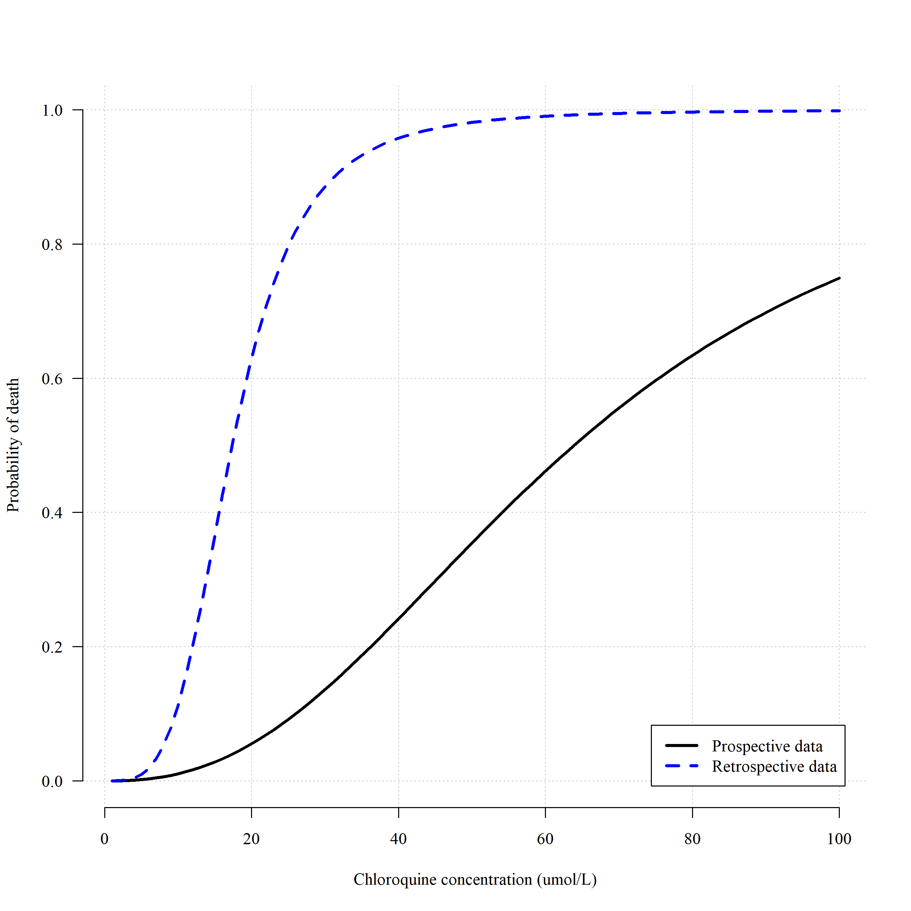<!-- -->


Admission concentration data versus peak concentration data

```r
par(las=1, family='serif')
plot(xs, colMeans(out_peak), ylab='Probability of death', xlab='CQ whole blood (umol/L)', 
     type='l',lwd=3,xaxt='n',col='red', ylim=c(0,1))
lines(xs, colMeans(out_ad), lty=2,lwd=3, col = 'blue')
polygon(c(xs, rev(xs)), c(apply(out_peak,2,quantile, probs=0.025),
                          rev(apply(out_peak,2,quantile, probs=0.975))),
        col = adjustcolor('red',alpha.f = .3),border = NA)
polygon(c(xs, rev(xs)), c(apply(out_ad,2,quantile, probs=0.025),
                          rev(apply(out_ad,2,quantile, probs=0.975))),
        col = adjustcolor('blue',alpha.f = .3),border = NA)
lines(xs, colMeans(out_ad), lty=2,lwd=3, col = 'blue')
lines(xs, colMeans(out_peak), lwd=3, col = 'red')

axis(1, at=log10(x_points),labels = x_points)
axis(1, at = log10(c(1:10,seq(20,100,by=10))), labels = NA, tick = T)

abline(h=c(0.05,.1,.2),lty=2,v=log10(20))
legend('topleft',legend = c('Peak observed concentrations','Admission concentrations'),
       col=c('red','blue'),lwd=3, lty = 1:2,inset=0.03)
```

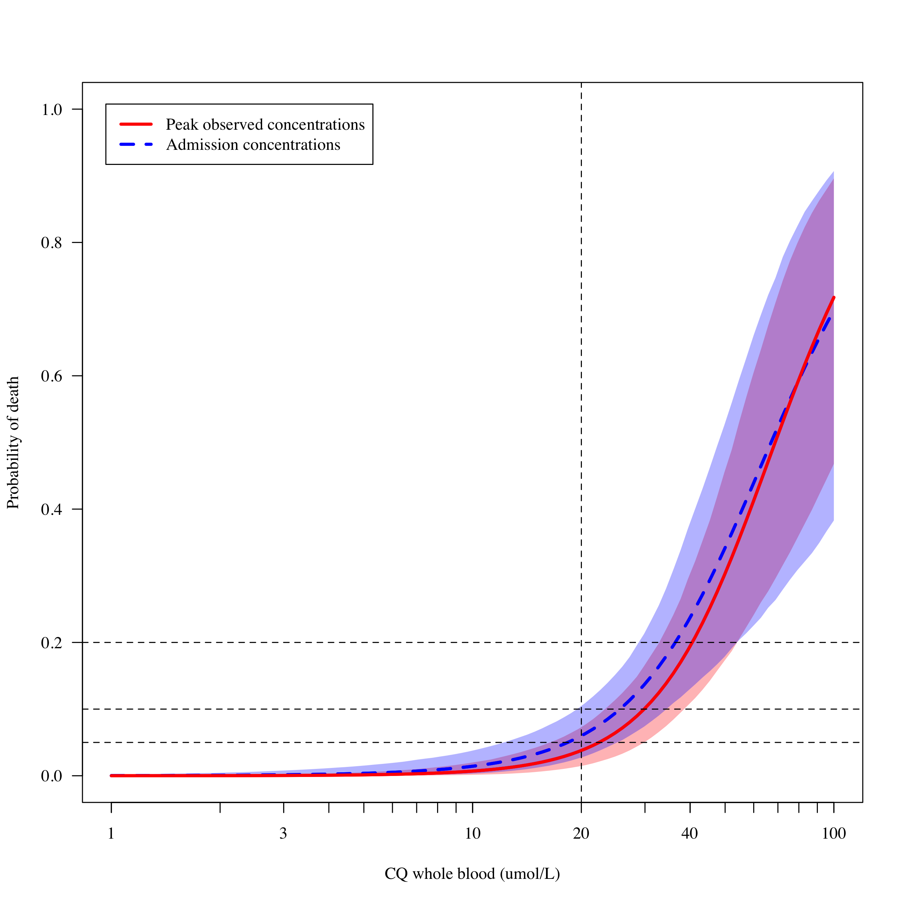<!-- -->

## Final model

This uses all prospective data and admission concentrations

```r
pooled_data = dplyr::filter(pooled_data, Prospective=='Yes')
writeLines(sprintf('We have data on %s admission concentrations and outcomes',nrow(pooled_data)))
```

```
## We have data on 258 admission concentrations and outcomes
```


```r
par(mfrow=c(2,1),las=1, cex.lab=1.5, cex.axis=1.5, family='serif')
hist(log10(pooled_data$CQumolL_Admission[pooled_data$Outcome==0]), xlim = log10(c(1,100)),
     main='', breaks = seq(-1.25,2,by=.25/2),ylab='Number of patients',
     xaxt='n',xlab = expression(paste('Chloroquine concentration (',mu,'mol/L)')), 
     col=adjustcolor('blue',alpha.f = .5))
hist(log10(pooled_data$CQumolL_Admission[pooled_data$Outcome==1]), 
     breaks = seq(1,2,by=.25/2), add=T, col=adjustcolor('red',alpha.f = .5))
legend('topleft',  fill=adjustcolor(c('blue','red'),alpha.f = .5),
       legend = c('Lived','Died'),inset=0.02, cex=1.5, bty='n',title = 'Outcome')
axis(1, at=log10(x_points),labels = x_points)
axis(1, at = log10(c(1:10,seq(20,100,by=10))), labels = NA, tick = T)

plot(xs, colMeans(out_prospect), type = 'l', ylim = c(0,1),lwd=3, 
     xlab = expression(paste('Chloroquine concentration (',mu,'mol/L)')), 
     xlim = log10(c(1,100)),
     ylab = 'Probability of death',xaxt='n')
polygon(c(xs, rev(xs)), 
        c(apply(out_prospect,2,quantile, probs=0.025),
          rev(apply(out_prospect,2,quantile, probs=0.975))),
        col = adjustcolor('grey',alpha.f = .4),border = NA)
lines(xs, colMeans(out_prospect), type = 'l', ylim = c(0,1),lwd=3)
axis(1, at=log10(x_points),labels = x_points)
axis(1, at = log10(c(1:10,seq(20,100,by=10))), labels = NA, tick = T)

abline(h=0.05, v=log10(20), lty=2)
```

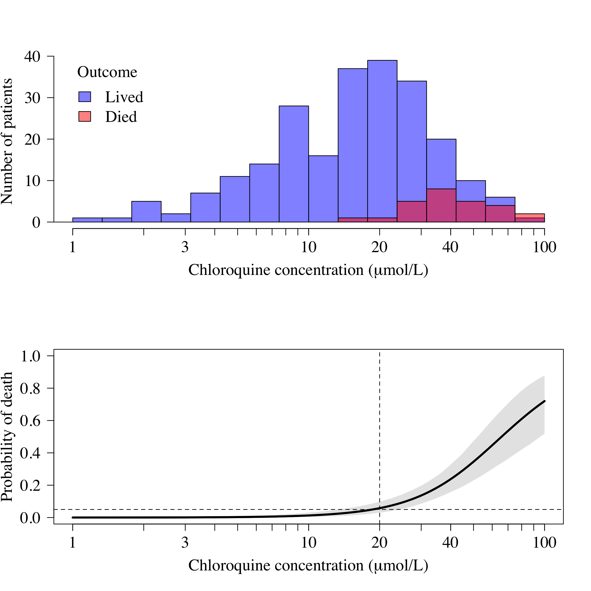<!-- -->


## Couple with PK model of chloroquine

Use Cmax values output by PK model of chloroquine.


```r
load('Population_Cmax_values.RData')
K_draws = length(thetas_prospect$alpha)
fatality_rates = array(dim = c(length(fs), 11, K_draws))
upperCI_fatality_rates =
  lowerCI_fatality_rates =
  mean_fatality_rates = 
  array(dim = c(length(fs), 11))

c_maxs_40 = c_maxs_70 = array(dim = c(length(fs), 1000))
weights = seq(40, 90, by = 5)
q = 2
# We do the malaria flat dosing first in order to then assess the fold increase in risk
for(j in 1:length(weights)){
  ws=weights[j]
  cqs = Cmax_pop[6,j, ,q]
  if(ws == 70) c_maxs_70[6,] = cqs
  if(ws == 40) c_maxs_40[6,] = cqs
  
  for(k in 1:K_draws){
    ps = inv.logit(thetas_prospect$alpha[k] + thetas_prospect$beta[k] * log10(cqs))
    fatality_rates[6,j,k] = 100*mean(ps, na.rm=T)
  }
  mean_fatality_rates[6,j] = mean(fatality_rates[6,j,])
  upperCI_fatality_rates[6,j] = quantile(fatality_rates[6,j,],probs=0.975)
  lowerCI_fatality_rates[6,j] = quantile(fatality_rates[6,j,],probs=0.025)
}

fold_increase_risk = array(dim = c(length(fs)-1, 11, K_draws))
upperCI_fold_increase =
  lowerCI_fold_increase =
  mean_fold_increase = 
  array(dim = c(length(fs)-1, 11))
for(i in 1:(length(fs)-1)){
  for(j in 1:length(weights)){
    ws=weights[j]
    cqs = Cmax_pop[i,j, ,q]
    if(ws == 70) c_maxs_70[i,] = cqs
    if(ws == 40) c_maxs_40[i,] = cqs
    
    for(k in 1:K_draws){
      ps = inv.logit(thetas_prospect$alpha[k] + thetas_prospect$beta[k] * log10(cqs))
      fatality_rates[i,j,k] = 100*mean(ps, na.rm=T)
      fold_increase_risk[i,j,k] = fatality_rates[i,j,k]/fatality_rates[6,j,k]
    }
    mean_fatality_rates[i,j] = mean(fatality_rates[i,j,])
    upperCI_fatality_rates[i,j] = quantile(fatality_rates[i,j,],probs=0.975)
    lowerCI_fatality_rates[i,j] = quantile(fatality_rates[i,j,],probs=0.025)
    
    mean_fold_increase[i,j] = mean(fold_increase_risk[i,j,])
    upperCI_fold_increase[i,j] = quantile(fold_increase_risk[i,j,],probs=0.975)
    lowerCI_fold_increase[i,j] = quantile(fold_increase_risk[i,j,],probs=0.025)
  }
}
```

Median concentration at 70 kgs

```r
for(i in 1:length(fs)){
  j = which(weights==70)
  writeLines(fs[i])
  writeLines(as.character(round(median(Cmax_pop[i,j,,q], na.rm = T),1)))
}
```

```
## CQ1_Brazil
## 6.9
## CQ2_flat10
## 3.7
## CQ3_flat7
## 3.4
## CQ4_BW10
## 3.8
## CQ5_BW7
## 3.5
## CQ6_malaria_flat
## 2.6
```

Absolute fatality predictions

```r
writeLines('Mean prediction\n')
```

```
## Mean prediction
```

```r
colnames(mean_fatality_rates) = weights
rownames(mean_fatality_rates) = fs
round(mean_fatality_rates,1)
```

```
##                   40  45  50  55  60  65  70  75  80  85  90
## CQ1_Brazil       2.0 1.7 1.3 1.1 0.9 0.8 0.7 0.6 0.5 0.5 0.4
## CQ2_flat10       0.5 0.5 0.3 0.3 0.3 0.2 0.2 0.2 0.2 0.1 0.1
## CQ3_flat7        0.4 0.4 0.3 0.3 0.2 0.2 0.2 0.1 0.1 0.1 0.1
## CQ4_BW10         0.1 0.1 0.3 0.3 0.3 0.2 0.2 0.2 0.4 0.3 0.3
## CQ5_BW7          0.1 0.1 0.3 0.3 0.2 0.2 0.2 0.1 0.3 0.2 0.2
## CQ6_malaria_flat 0.3 0.2 0.2 0.1 0.1 0.1 0.1 0.1 0.1 0.1 0.1
```

```r
writeLines('\nLower CI prediction\n')
```

```
## 
## Lower CI prediction
```

```r
colnames(lowerCI_fatality_rates) = weights
rownames(lowerCI_fatality_rates) = fs
round(lowerCI_fatality_rates,2)
```

```
##                    40   45   50   55   60   65   70   75   80   85   90
## CQ1_Brazil       0.81 0.61 0.44 0.34 0.26 0.23 0.18 0.15 0.12 0.11 0.09
## CQ2_flat10       0.12 0.10 0.06 0.05 0.04 0.03 0.03 0.02 0.02 0.02 0.01
## CQ3_flat7        0.09 0.06 0.05 0.04 0.03 0.03 0.02 0.02 0.01 0.01 0.01
## CQ4_BW10         0.01 0.01 0.06 0.05 0.04 0.03 0.03 0.02 0.07 0.05 0.05
## CQ5_BW7          0.01 0.01 0.04 0.04 0.03 0.03 0.02 0.02 0.05 0.04 0.04
## CQ6_malaria_flat 0.04 0.03 0.03 0.02 0.01 0.01 0.01 0.01 0.01 0.00 0.00
```

```r
writeLines('\nUpper CI prediction\n')
```

```
## 
## Upper CI prediction
```

```r
colnames(upperCI_fatality_rates) = weights
rownames(upperCI_fatality_rates) = fs
round(upperCI_fatality_rates,2)
```

```
##                    40   45   50   55   60   65   70   75   80   85   90
## CQ1_Brazil       4.15 3.58 3.00 2.62 2.23 2.09 1.85 1.66 1.50 1.42 1.24
## CQ2_flat10       1.45 1.30 1.06 0.97 0.83 0.72 0.66 0.58 0.56 0.48 0.46
## CQ3_flat7        1.26 1.06 0.91 0.82 0.69 0.64 0.56 0.49 0.45 0.42 0.40
## CQ4_BW10         0.47 0.43 1.03 0.97 0.83 0.72 0.68 0.59 1.11 0.96 0.90
## CQ5_BW7          0.42 0.36 0.87 0.82 0.69 0.64 0.58 0.51 0.89 0.81 0.76
## CQ6_malaria_flat 0.86 0.73 0.63 0.52 0.46 0.43 0.36 0.31 0.31 0.27 0.26
```

Relative fatality predictions

```r
writeLines('Mean relative increase in risk\n')
```

```
## Mean relative increase in risk
```

```r
colnames(mean_fold_increase) = weights
rownames(mean_fold_increase) = fs[-6]
round(mean_fold_increase,1)
```

```
##             40  45  50   55  60  65   70   75   80   85   90
## CQ1_Brazil 9.8 9.8 9.4 10.1 9.7 9.9 10.5 11.4 10.1 11.5 10.1
## CQ2_flat10 2.1 2.3 2.0  2.3 2.3 2.0  2.3  2.4  2.4  2.3  2.3
## CQ3_flat7  1.7 1.7 1.6  1.8 1.8 1.8  1.8  1.9  1.8  1.9  1.9
## CQ4_BW10   0.4 0.5 1.9  2.3 2.3 2.0  2.4  2.5  6.3  6.2  6.2
## CQ5_BW7    0.4 0.4 1.5  1.8 1.8 1.8  2.0  2.0  4.6  4.9  5.0
```

```r
print(round(rowMeans(mean_fold_increase)))
```

```
## CQ1_Brazil CQ2_flat10  CQ3_flat7   CQ4_BW10    CQ5_BW7 
##         10          2          2          3          2
```

```r
writeLines('\nLower CI prediction\n')
```

```
## 
## Lower CI prediction
```

```r
colnames(lowerCI_fold_increase) = weights
rownames(lowerCI_fold_increase) = fs[-6]
round(lowerCI_fold_increase,2)
```

```
##              40   45   50   55   60   65   70   75   80   85   90
## CQ1_Brazil 4.51 4.57 4.48 4.69 4.56 4.60 4.80 5.04 4.67 5.07 4.70
## CQ2_flat10 1.66 1.74 1.64 1.79 1.76 1.65 1.78 1.83 1.82 1.81 1.79
## CQ3_flat7  1.45 1.42 1.41 1.53 1.47 1.48 1.53 1.57 1.48 1.55 1.56
## CQ4_BW10   0.33 0.36 1.59 1.79 1.76 1.65 1.83 1.87 3.47 3.44 3.41
## CQ5_BW7    0.26 0.25 1.36 1.53 1.47 1.48 1.59 1.63 2.80 2.93 2.94
```

```r
print(round(rowMeans(lowerCI_fold_increase)))
```

```
## CQ1_Brazil CQ2_flat10  CQ3_flat7   CQ4_BW10    CQ5_BW7 
##          5          2          1          2          2
```

```r
writeLines('\nUpper CI prediction\n')
```

```
## 
## Upper CI prediction
```

```r
colnames(upperCI_fold_increase) = weights
rownames(upperCI_fold_increase) = fs[-6]
round(upperCI_fold_increase,2)
```

```
##               40    45    50    55    60    65    70    75    80    85    90
## CQ1_Brazil 19.52 19.16 17.92 19.69 18.67 19.40 20.70 23.03 19.72 23.43 19.85
## CQ2_flat10  2.65  2.94  2.46  2.98  2.87  2.49  2.98  3.18  3.15  3.02  3.07
## CQ3_flat7   2.05  1.93  1.84  2.20  2.10  2.11  2.24  2.34  2.11  2.28  2.35
## CQ4_BW10    0.57  0.59  2.34  2.98  2.87  2.49  3.14  3.34 11.01 10.57 10.74
## CQ5_BW7     0.50  0.49  1.71  2.20  2.10  2.11  2.41  2.51  7.26  7.84  8.09
```

```r
print(round(rowMeans(upperCI_fold_increase)))
```

```
## CQ1_Brazil CQ2_flat10  CQ3_flat7   CQ4_BW10    CQ5_BW7 
##         20          3          2          5          3
```


```r
cols = brewer.pal(3, name = 'Dark2')
cols = c(cols[1], rep(cols[2],4),cols[3])
ltys = c(1,1,1,2,2,1)
lwds = c(4,4,2,4,2,2)/2
x_points = c(1,3,10,20,40,100)

par(mfrow=c(2,2),las=1, cex.lab=1.2, cex.axis=1.2, family='serif',bty='n')
hist(log10(pooled_data$CQumolL_Admission[pooled_data$Outcome==0]), xlim = log10(c(1,100)),
     main='', breaks = seq(-1.25,2,by=.25/2),ylab='Number of patients',
     xaxt='n',xlab = expression(paste('Whole blood chloroquine concentration (',mu,'mol/L)')),
     col=adjustcolor('blue',alpha.f = .5))
hist(log10(pooled_data$CQumolL_Admission[pooled_data$Outcome==1]), 
     breaks = seq(1,2,by=.25/2), add=T, col=adjustcolor('red',alpha.f = .5))
legend('topleft',  fill=adjustcolor(c('blue','red'),alpha.f = .5),
       legend = c('Lived','Died'),inset=0.02, cex=1.5, bty='n',title = 'Outcome')
axis(1, at=log10(x_points),labels = x_points)
axis(1, at = log10(c(1:10,seq(20,100,by=10))), labels = NA, tick = T)
mtext(text = 'A', side = 3, adj = 0, cex = 1.5)


plot(xs, colMeans(out_prospect), type = 'l', ylim = c(0,1),lwd=3, 
     xlab = expression(paste('Whole blood chloroquine concentration (',mu,'mol/L)')), 
     xlim = log10(c(1,100)),panel.first = grid(), 
     ylab = 'Probability of death',xaxt='n')
polygon(c(xs, rev(xs)), 
        c(apply(out_prospect,2,quantile, probs=0.025),
          rev(apply(out_prospect,2,quantile, probs=0.975))),
        col = adjustcolor('grey',alpha.f = .4),border = NA)
lines(xs, colMeans(out_prospect), type = 'l', ylim = c(0,1),lwd=3)
axis(1, at=log10(x_points),labels = x_points)
abline(h=c(0.01, 0.05), v=log10(c(10, 20)), lty=2)
mtext(text = 'B', side = 3, adj = 0, cex = 1.5)
axis(1, at = log10(c(1:10,seq(20,100,by=10))), labels = NA, tick = T)

fs
```

```
## [1] "CQ1_Brazil"       "CQ2_flat10"       "CQ3_flat7"        "CQ4_BW10"        
## [5] "CQ5_BW7"          "CQ6_malaria_flat"
```

```r
c_names=c('600mg x2 (10d)',
          'Flat (10d)', 
          'Flat (7d)',
          'Weight-based (10d)',
          'Weight-based (7d)',
          'Flat: malaria (3d)')

# ****** 70 kilograms
plot(density(log10(c_maxs_70[1,]),na.rm = T), lwd=lwds[1], ylim=c(0,3),yaxt='n',ylab='',
     xlim=range(log10(c(1,100)),na.rm = T),lty=ltys[1],main = '', col=cols[1],
     xlab = expression('70kg adult whole blood chloroquine C'[max]*' ('*mu*'mol/L)'),xaxt='n')
for(i in 2:length(fs)){
  lines(density(log10(c_maxs_70[i, ]), na.rm = T), lty=ltys[i],lwd=lwds[i], col=cols[i])
}
axis(1, at=log10(x_points),labels = x_points)
axis(1, at = log10(c(1:10,seq(20,100,by=10))), labels = NA, tick = T)
mtext(text = 'C', side = 3, adj = 0, cex = 1.5)

plot(weights, mean_fatality_rates[1,],type='l',lty=ltys[1], xlab='Weight (kg)',col=cols[1],
     ylim = c(0,max(mean_fatality_rates)), panel.first = grid(), 
     lwd=lwds[1], ylab=expression('Probability of death from C'[max]))
for(i in 2:length(fs)){
  lines(weights, mean_fatality_rates[i,],lwd=lwds[i],lty=ltys[i], col=cols[i])
}

legend('topright',legend = c_names,lty=ltys, inset=0.02,col=cols,lwd=lwds)
mtext(text = 'D', side = 3, adj = 0, cex = 1.5)
```

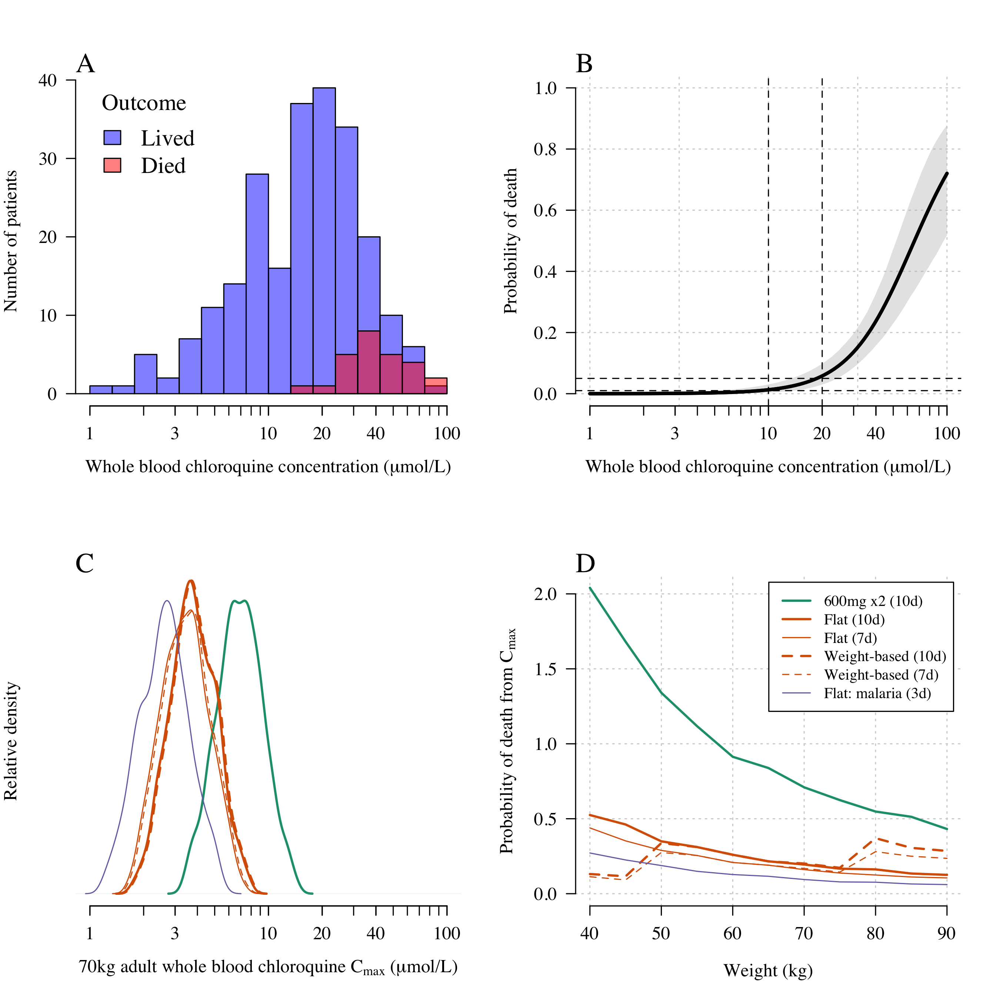<!-- -->


```r
par(las=1, family='serif')
plot(weights, mean_fold_increase[1,],type='l',lty=ltys[1], xlab='Weight (kg)',col=cols[1],
     ylim = c(0,max(mean_fold_increase)), panel.first = grid(), 
     lwd=lwds[1], ylab=expression('Relative increase in toxicity from C'[max]))
for(i in 2:(length(fs)-1)){
  lines(weights, mean_fold_increase[i,],lwd=lwds[i],lty=ltys[i], col=cols[i])
}
abline(h= 1, lwd=3)
legend('left',legend = c_names,lty=ltys, inset=0.02,col=cols,lwd=lwds)
```

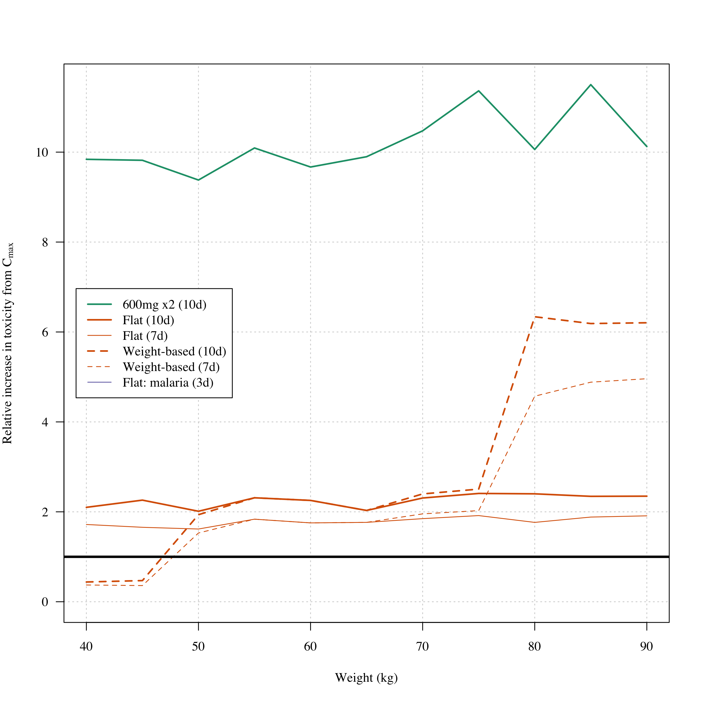<!-- -->


Distribution of Cmax for the Brazil dosing regimen

```r
for(ws in weights){
  plot(density(log10(Cmax_pop[1, which(ws==weights),,q ]),na.rm = T), lwd=lwds[1], ylim=c(0,3),yaxt='n',ylab='',
       xlim=range(log10(c(1,100)),na.rm = T),lty=ltys[1], col=cols[1],main=ws,
       xlab = expression('whole blood chloroquine C'[max]*' ('*mu*'mol/L)'),xaxt='n')
  writeLines(sprintf('At %s kg, %s%% of individuals will have Cmax greater than 15 for regimen %s', 
                     ws,round(100*mean(Cmax_pop[1, which(ws==weights),,q ] > 15 ,na.rm = T),1), fs[1]))
  writeLines(sprintf('At %s kg, %s%% of individuals will have Cmax greater than 10 for regimen %s', 
                     ws,round(100*mean(Cmax_pop[1, which(ws==weights),,q ] > 10 ,na.rm = T),1), fs[1]))
  for(i in 2:length(fs)){
    lines(density(log10(Cmax_pop[i, which(ws==weights),,q ]), na.rm = T), 
          lty=ltys[i],lwd=lwds[i], col=cols[i])
    writeLines(sprintf('At %s kg, %s%% of individuals will have Cmax greater than 15 for regimen %s', 
                       ws,round(100*mean(Cmax_pop[i, which(ws==weights),,q ] > 15 ,na.rm = T),1), fs[i]))
    writeLines(sprintf('At %s kg, %s%% of individuals will have Cmax greater than 15 for regimen %s', 
                       ws,round(100*mean(Cmax_pop[i, which(ws==weights),,q ] > 10 ,na.rm = T),1), fs[i]))
  }
  axis(1, at=log10(x_points),labels = x_points)
  axis(1, at = log10(c(1:10,seq(20,100,by=10))), labels = NA, tick = T)
}
```

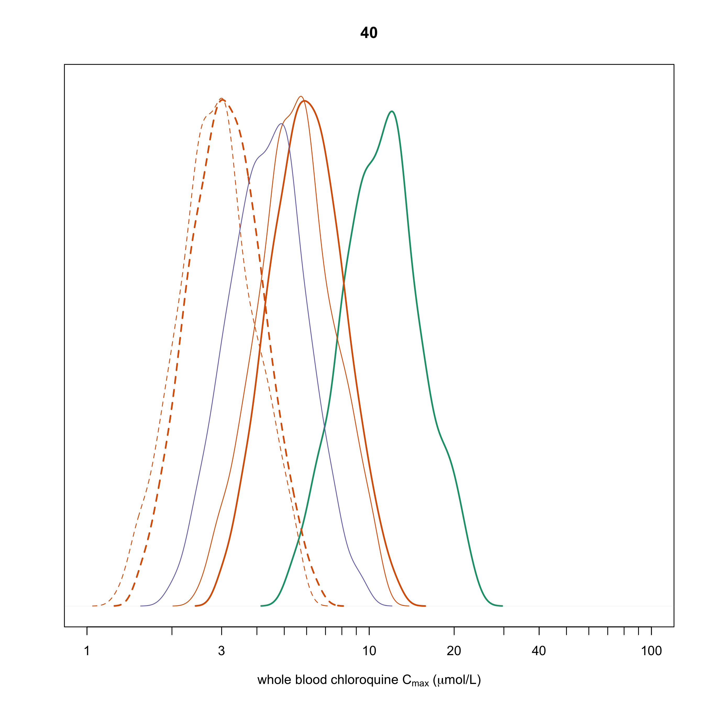<!-- -->

```
## At 40 kg, 17.7% of individuals will have Cmax greater than 15 for regimen CQ1_Brazil
## At 40 kg, 61.2% of individuals will have Cmax greater than 10 for regimen CQ1_Brazil
## At 40 kg, 0% of individuals will have Cmax greater than 15 for regimen CQ2_flat10
## At 40 kg, 4.5% of individuals will have Cmax greater than 15 for regimen CQ2_flat10
## At 40 kg, 0% of individuals will have Cmax greater than 15 for regimen CQ3_flat7
## At 40 kg, 2.3% of individuals will have Cmax greater than 15 for regimen CQ3_flat7
## At 40 kg, 0% of individuals will have Cmax greater than 15 for regimen CQ4_BW10
## At 40 kg, 0% of individuals will have Cmax greater than 15 for regimen CQ4_BW10
## At 40 kg, 0% of individuals will have Cmax greater than 15 for regimen CQ5_BW7
## At 40 kg, 0% of individuals will have Cmax greater than 15 for regimen CQ5_BW7
## At 40 kg, 0% of individuals will have Cmax greater than 15 for regimen CQ6_malaria_flat
## At 40 kg, 0% of individuals will have Cmax greater than 15 for regimen CQ6_malaria_flat
```

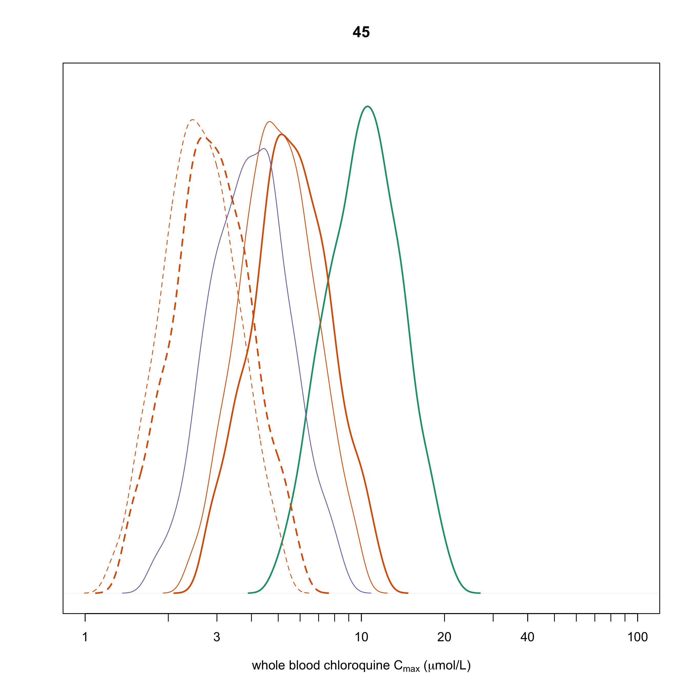<!-- -->

```
## At 45 kg, 10.9% of individuals will have Cmax greater than 15 for regimen CQ1_Brazil
## At 45 kg, 54.5% of individuals will have Cmax greater than 10 for regimen CQ1_Brazil
## At 45 kg, 0% of individuals will have Cmax greater than 15 for regimen CQ2_flat10
## At 45 kg, 3.8% of individuals will have Cmax greater than 15 for regimen CQ2_flat10
## At 45 kg, 0% of individuals will have Cmax greater than 15 for regimen CQ3_flat7
## At 45 kg, 0.2% of individuals will have Cmax greater than 15 for regimen CQ3_flat7
## At 45 kg, 0% of individuals will have Cmax greater than 15 for regimen CQ4_BW10
## At 45 kg, 0% of individuals will have Cmax greater than 15 for regimen CQ4_BW10
## At 45 kg, 0% of individuals will have Cmax greater than 15 for regimen CQ5_BW7
## At 45 kg, 0% of individuals will have Cmax greater than 15 for regimen CQ5_BW7
## At 45 kg, 0% of individuals will have Cmax greater than 15 for regimen CQ6_malaria_flat
## At 45 kg, 0% of individuals will have Cmax greater than 15 for regimen CQ6_malaria_flat
```

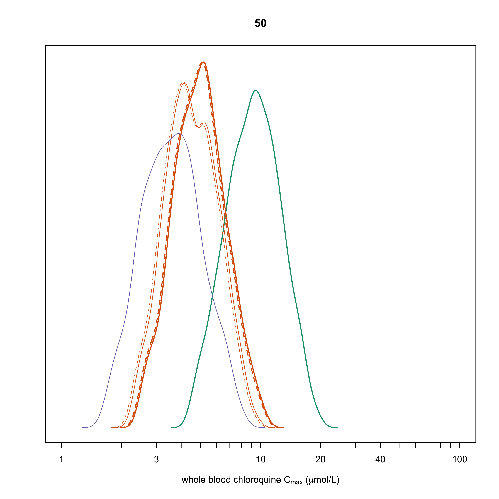<!-- -->

```
## At 50 kg, 6.2% of individuals will have Cmax greater than 15 for regimen CQ1_Brazil
## At 50 kg, 40.4% of individuals will have Cmax greater than 10 for regimen CQ1_Brazil
## At 50 kg, 0% of individuals will have Cmax greater than 15 for regimen CQ2_flat10
## At 50 kg, 0.6% of individuals will have Cmax greater than 15 for regimen CQ2_flat10
## At 50 kg, 0% of individuals will have Cmax greater than 15 for regimen CQ3_flat7
## At 50 kg, 0% of individuals will have Cmax greater than 15 for regimen CQ3_flat7
## At 50 kg, 0% of individuals will have Cmax greater than 15 for regimen CQ4_BW10
## At 50 kg, 0.4% of individuals will have Cmax greater than 15 for regimen CQ4_BW10
## At 50 kg, 0% of individuals will have Cmax greater than 15 for regimen CQ5_BW7
## At 50 kg, 0% of individuals will have Cmax greater than 15 for regimen CQ5_BW7
## At 50 kg, 0% of individuals will have Cmax greater than 15 for regimen CQ6_malaria_flat
## At 50 kg, 0% of individuals will have Cmax greater than 15 for regimen CQ6_malaria_flat
```

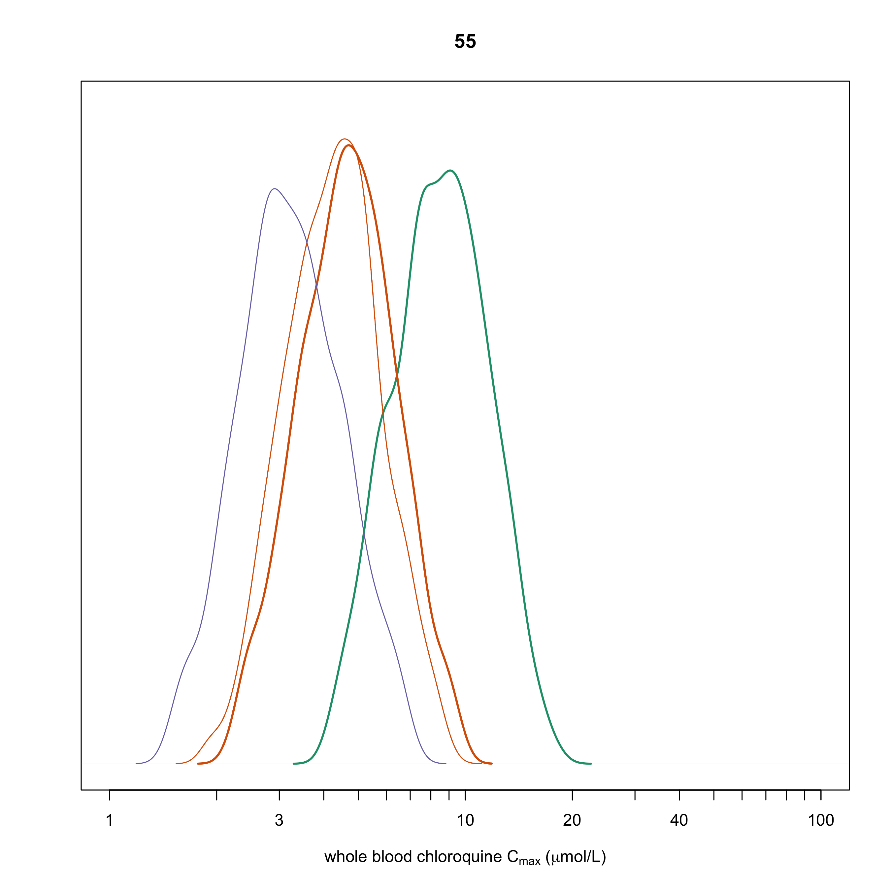<!-- -->

```
## At 55 kg, 2.3% of individuals will have Cmax greater than 15 for regimen CQ1_Brazil
## At 55 kg, 31.4% of individuals will have Cmax greater than 10 for regimen CQ1_Brazil
## At 55 kg, 0% of individuals will have Cmax greater than 15 for regimen CQ2_flat10
## At 55 kg, 0% of individuals will have Cmax greater than 15 for regimen CQ2_flat10
## At 55 kg, 0% of individuals will have Cmax greater than 15 for regimen CQ3_flat7
## At 55 kg, 0% of individuals will have Cmax greater than 15 for regimen CQ3_flat7
## At 55 kg, 0% of individuals will have Cmax greater than 15 for regimen CQ4_BW10
## At 55 kg, 0% of individuals will have Cmax greater than 15 for regimen CQ4_BW10
## At 55 kg, 0% of individuals will have Cmax greater than 15 for regimen CQ5_BW7
## At 55 kg, 0% of individuals will have Cmax greater than 15 for regimen CQ5_BW7
## At 55 kg, 0% of individuals will have Cmax greater than 15 for regimen CQ6_malaria_flat
## At 55 kg, 0% of individuals will have Cmax greater than 15 for regimen CQ6_malaria_flat
```

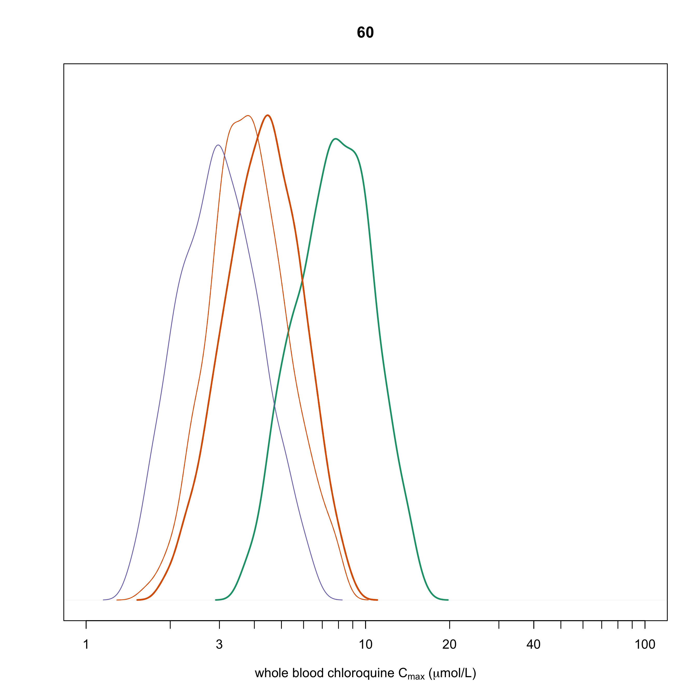<!-- -->

```
## At 60 kg, 0.6% of individuals will have Cmax greater than 15 for regimen CQ1_Brazil
## At 60 kg, 21.3% of individuals will have Cmax greater than 10 for regimen CQ1_Brazil
## At 60 kg, 0% of individuals will have Cmax greater than 15 for regimen CQ2_flat10
## At 60 kg, 0% of individuals will have Cmax greater than 15 for regimen CQ2_flat10
## At 60 kg, 0% of individuals will have Cmax greater than 15 for regimen CQ3_flat7
## At 60 kg, 0% of individuals will have Cmax greater than 15 for regimen CQ3_flat7
## At 60 kg, 0% of individuals will have Cmax greater than 15 for regimen CQ4_BW10
## At 60 kg, 0% of individuals will have Cmax greater than 15 for regimen CQ4_BW10
## At 60 kg, 0% of individuals will have Cmax greater than 15 for regimen CQ5_BW7
## At 60 kg, 0% of individuals will have Cmax greater than 15 for regimen CQ5_BW7
## At 60 kg, 0% of individuals will have Cmax greater than 15 for regimen CQ6_malaria_flat
## At 60 kg, 0% of individuals will have Cmax greater than 15 for regimen CQ6_malaria_flat
```

<!-- -->

```
## At 65 kg, 0.8% of individuals will have Cmax greater than 15 for regimen CQ1_Brazil
## At 65 kg, 18.3% of individuals will have Cmax greater than 10 for regimen CQ1_Brazil
## At 65 kg, 0% of individuals will have Cmax greater than 15 for regimen CQ2_flat10
## At 65 kg, 0% of individuals will have Cmax greater than 15 for regimen CQ2_flat10
## At 65 kg, 0% of individuals will have Cmax greater than 15 for regimen CQ3_flat7
## At 65 kg, 0% of individuals will have Cmax greater than 15 for regimen CQ3_flat7
## At 65 kg, 0% of individuals will have Cmax greater than 15 for regimen CQ4_BW10
## At 65 kg, 0% of individuals will have Cmax greater than 15 for regimen CQ4_BW10
## At 65 kg, 0% of individuals will have Cmax greater than 15 for regimen CQ5_BW7
## At 65 kg, 0% of individuals will have Cmax greater than 15 for regimen CQ5_BW7
## At 65 kg, 0% of individuals will have Cmax greater than 15 for regimen CQ6_malaria_flat
## At 65 kg, 0% of individuals will have Cmax greater than 15 for regimen CQ6_malaria_flat
```

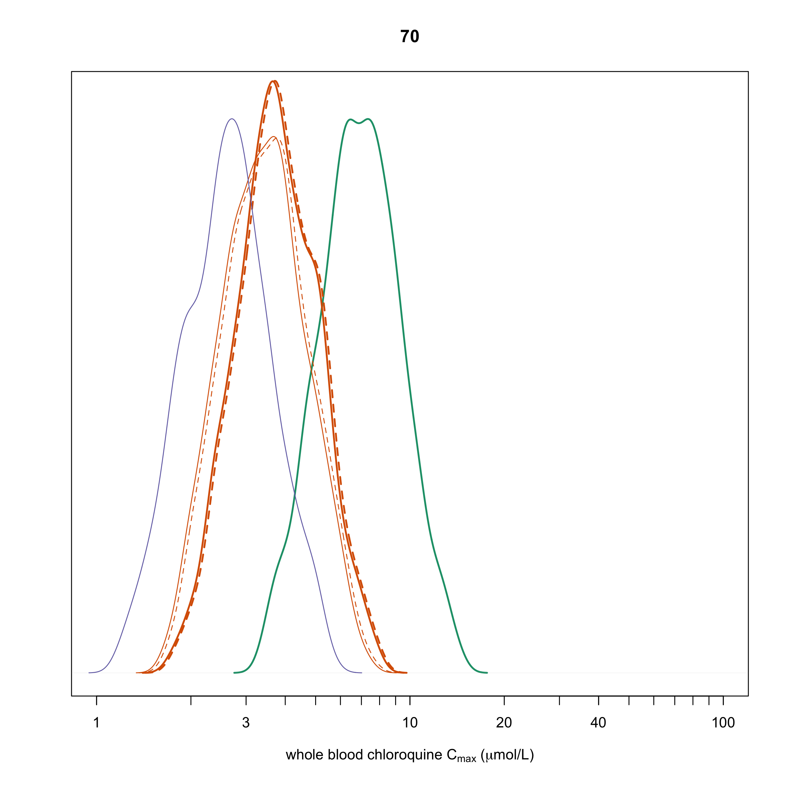<!-- -->

```
## At 70 kg, 0% of individuals will have Cmax greater than 15 for regimen CQ1_Brazil
## At 70 kg, 10.7% of individuals will have Cmax greater than 10 for regimen CQ1_Brazil
## At 70 kg, 0% of individuals will have Cmax greater than 15 for regimen CQ2_flat10
## At 70 kg, 0% of individuals will have Cmax greater than 15 for regimen CQ2_flat10
## At 70 kg, 0% of individuals will have Cmax greater than 15 for regimen CQ3_flat7
## At 70 kg, 0% of individuals will have Cmax greater than 15 for regimen CQ3_flat7
## At 70 kg, 0% of individuals will have Cmax greater than 15 for regimen CQ4_BW10
## At 70 kg, 0% of individuals will have Cmax greater than 15 for regimen CQ4_BW10
## At 70 kg, 0% of individuals will have Cmax greater than 15 for regimen CQ5_BW7
## At 70 kg, 0% of individuals will have Cmax greater than 15 for regimen CQ5_BW7
## At 70 kg, 0% of individuals will have Cmax greater than 15 for regimen CQ6_malaria_flat
## At 70 kg, 0% of individuals will have Cmax greater than 15 for regimen CQ6_malaria_flat
```

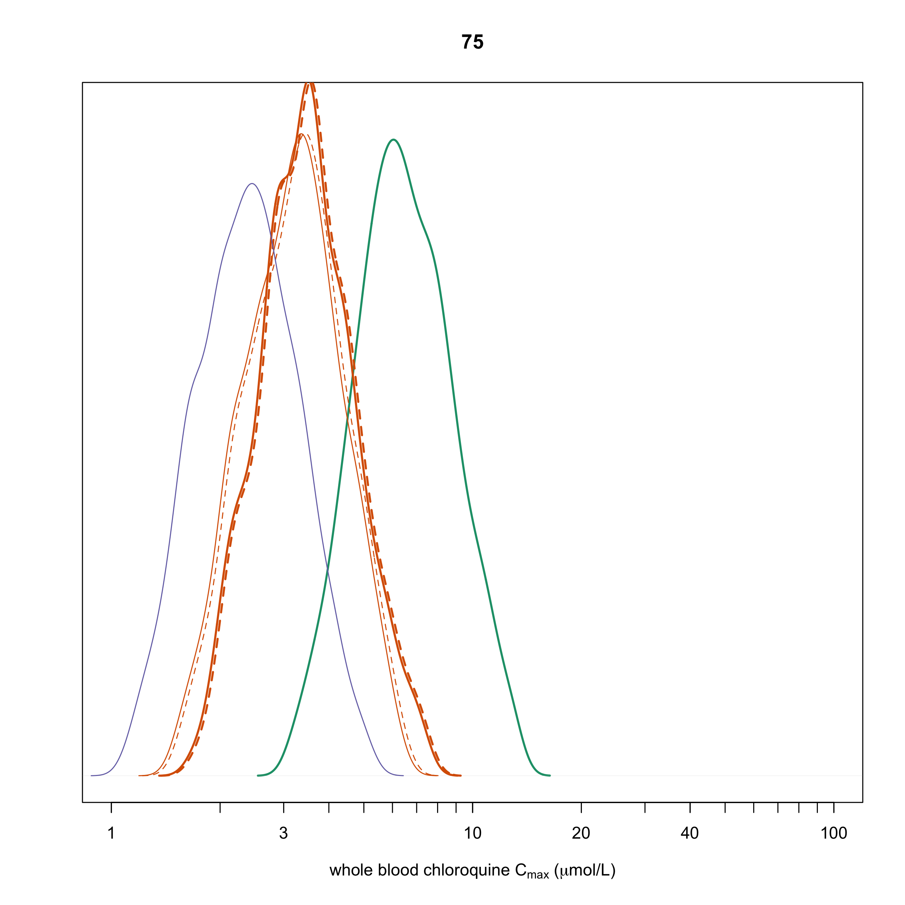<!-- -->

```
## At 75 kg, 0% of individuals will have Cmax greater than 15 for regimen CQ1_Brazil
## At 75 kg, 9.2% of individuals will have Cmax greater than 10 for regimen CQ1_Brazil
## At 75 kg, 0% of individuals will have Cmax greater than 15 for regimen CQ2_flat10
## At 75 kg, 0% of individuals will have Cmax greater than 15 for regimen CQ2_flat10
## At 75 kg, 0% of individuals will have Cmax greater than 15 for regimen CQ3_flat7
## At 75 kg, 0% of individuals will have Cmax greater than 15 for regimen CQ3_flat7
## At 75 kg, 0% of individuals will have Cmax greater than 15 for regimen CQ4_BW10
## At 75 kg, 0% of individuals will have Cmax greater than 15 for regimen CQ4_BW10
## At 75 kg, 0% of individuals will have Cmax greater than 15 for regimen CQ5_BW7
## At 75 kg, 0% of individuals will have Cmax greater than 15 for regimen CQ5_BW7
## At 75 kg, 0% of individuals will have Cmax greater than 15 for regimen CQ6_malaria_flat
## At 75 kg, 0% of individuals will have Cmax greater than 15 for regimen CQ6_malaria_flat
```

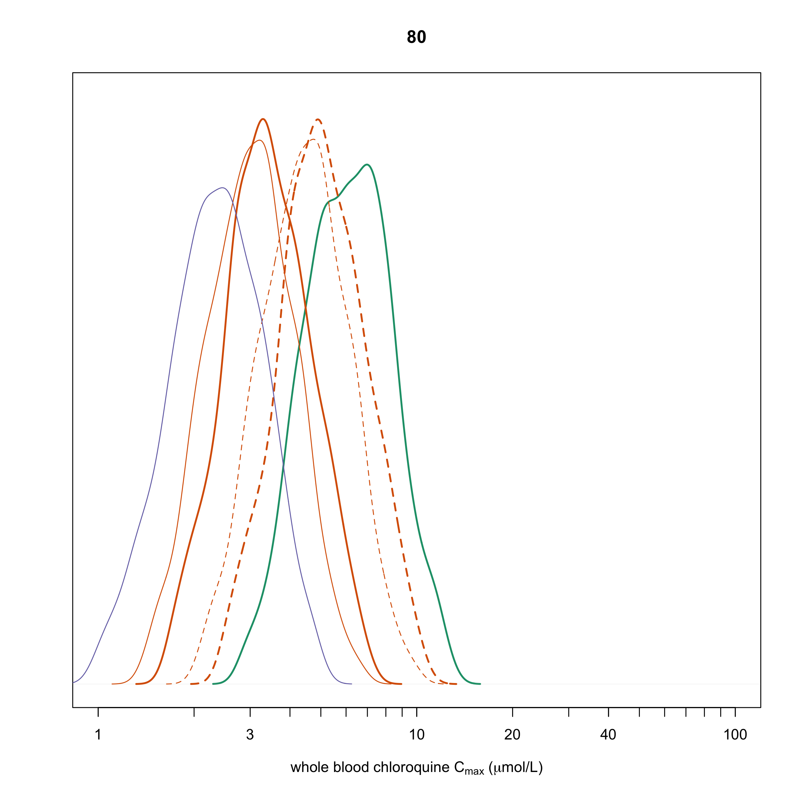<!-- -->

```
## At 80 kg, 0% of individuals will have Cmax greater than 15 for regimen CQ1_Brazil
## At 80 kg, 5.4% of individuals will have Cmax greater than 10 for regimen CQ1_Brazil
## At 80 kg, 0% of individuals will have Cmax greater than 15 for regimen CQ2_flat10
## At 80 kg, 0% of individuals will have Cmax greater than 15 for regimen CQ2_flat10
## At 80 kg, 0% of individuals will have Cmax greater than 15 for regimen CQ3_flat7
## At 80 kg, 0% of individuals will have Cmax greater than 15 for regimen CQ3_flat7
## At 80 kg, 0% of individuals will have Cmax greater than 15 for regimen CQ4_BW10
## At 80 kg, 0.7% of individuals will have Cmax greater than 15 for regimen CQ4_BW10
## At 80 kg, 0% of individuals will have Cmax greater than 15 for regimen CQ5_BW7
## At 80 kg, 0% of individuals will have Cmax greater than 15 for regimen CQ5_BW7
## At 80 kg, 0% of individuals will have Cmax greater than 15 for regimen CQ6_malaria_flat
## At 80 kg, 0% of individuals will have Cmax greater than 15 for regimen CQ6_malaria_flat
```

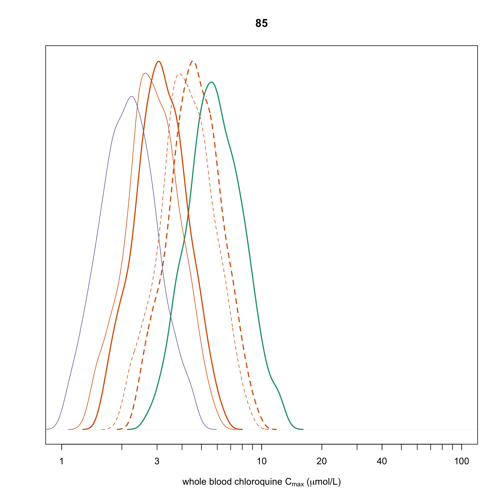<!-- -->

```
## At 85 kg, 0% of individuals will have Cmax greater than 15 for regimen CQ1_Brazil
## At 85 kg, 4.7% of individuals will have Cmax greater than 10 for regimen CQ1_Brazil
## At 85 kg, 0% of individuals will have Cmax greater than 15 for regimen CQ2_flat10
## At 85 kg, 0% of individuals will have Cmax greater than 15 for regimen CQ2_flat10
## At 85 kg, 0% of individuals will have Cmax greater than 15 for regimen CQ3_flat7
## At 85 kg, 0% of individuals will have Cmax greater than 15 for regimen CQ3_flat7
## At 85 kg, 0% of individuals will have Cmax greater than 15 for regimen CQ4_BW10
## At 85 kg, 0% of individuals will have Cmax greater than 15 for regimen CQ4_BW10
## At 85 kg, 0% of individuals will have Cmax greater than 15 for regimen CQ5_BW7
## At 85 kg, 0% of individuals will have Cmax greater than 15 for regimen CQ5_BW7
## At 85 kg, 0% of individuals will have Cmax greater than 15 for regimen CQ6_malaria_flat
## At 85 kg, 0% of individuals will have Cmax greater than 15 for regimen CQ6_malaria_flat
```

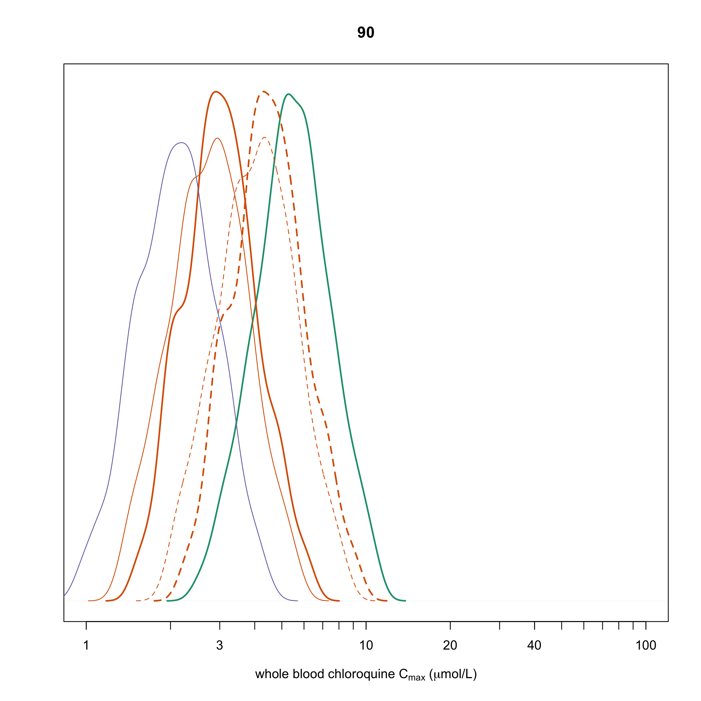<!-- -->

```
## At 90 kg, 0% of individuals will have Cmax greater than 15 for regimen CQ1_Brazil
## At 90 kg, 2.1% of individuals will have Cmax greater than 10 for regimen CQ1_Brazil
## At 90 kg, 0% of individuals will have Cmax greater than 15 for regimen CQ2_flat10
## At 90 kg, 0% of individuals will have Cmax greater than 15 for regimen CQ2_flat10
## At 90 kg, 0% of individuals will have Cmax greater than 15 for regimen CQ3_flat7
## At 90 kg, 0% of individuals will have Cmax greater than 15 for regimen CQ3_flat7
## At 90 kg, 0% of individuals will have Cmax greater than 15 for regimen CQ4_BW10
## At 90 kg, 0% of individuals will have Cmax greater than 15 for regimen CQ4_BW10
## At 90 kg, 0% of individuals will have Cmax greater than 15 for regimen CQ5_BW7
## At 90 kg, 0% of individuals will have Cmax greater than 15 for regimen CQ5_BW7
## At 90 kg, 0% of individuals will have Cmax greater than 15 for regimen CQ6_malaria_flat
## At 90 kg, 0% of individuals will have Cmax greater than 15 for regimen CQ6_malaria_flat
```

Make a Table of Results

```r
eps = c(10,15,20)
for(ep in eps){
  threshold_results = array(dim=c(length(fs), length(weights)))
  colnames(threshold_results) = weights
  rownames(threshold_results) = c_names
  
  for(i in 1:length(fs)){
    for(ws in weights){
      
      j = which(ws==weights)
      
      threshold_results[i,j] = round(100*mean(Cmax_pop[i,j,,q] > ep ,na.rm = T),1)
      
    }
  }
  print(threshold_results)
  write.csv(x = threshold_results, file = paste('threshold',ep,'.csv',sep=''))
}
```

```
##                      40   45   50   55   60   65   70  75  80  85  90
## 600mg x2 (10d)     61.2 54.5 40.4 31.4 21.3 18.3 10.7 9.2 5.4 4.7 2.1
## Flat (10d)          4.5  3.8  0.6  0.0  0.0  0.0  0.0 0.0 0.0 0.0 0.0
## Flat (7d)           2.3  0.2  0.0  0.0  0.0  0.0  0.0 0.0 0.0 0.0 0.0
## Weight-based (10d)  0.0  0.0  0.4  0.0  0.0  0.0  0.0 0.0 0.7 0.0 0.0
## Weight-based (7d)   0.0  0.0  0.0  0.0  0.0  0.0  0.0 0.0 0.0 0.0 0.0
## Flat: malaria (3d)  0.0  0.0  0.0  0.0  0.0  0.0  0.0 0.0 0.0 0.0 0.0
##                      40   45  50  55  60  65 70 75 80 85 90
## 600mg x2 (10d)     17.7 10.9 6.2 2.3 0.6 0.8  0  0  0  0  0
## Flat (10d)          0.0  0.0 0.0 0.0 0.0 0.0  0  0  0  0  0
## Flat (7d)           0.0  0.0 0.0 0.0 0.0 0.0  0  0  0  0  0
## Weight-based (10d)  0.0  0.0 0.0 0.0 0.0 0.0  0  0  0  0  0
## Weight-based (7d)   0.0  0.0 0.0 0.0 0.0 0.0  0  0  0  0  0
## Flat: malaria (3d)  0.0  0.0 0.0 0.0 0.0 0.0  0  0  0  0  0
##                     40  45 50 55 60 65 70 75 80 85 90
## 600mg x2 (10d)     3.9 0.7  0  0  0  0  0  0  0  0  0
## Flat (10d)         0.0 0.0  0  0  0  0  0  0  0  0  0
## Flat (7d)          0.0 0.0  0  0  0  0  0  0  0  0  0
## Weight-based (10d) 0.0 0.0  0  0  0  0  0  0  0  0  0
## Weight-based (7d)  0.0 0.0  0  0  0  0  0  0  0  0  0
## Flat: malaria (3d) 0.0 0.0  0  0  0  0  0  0  0  0  0
```

