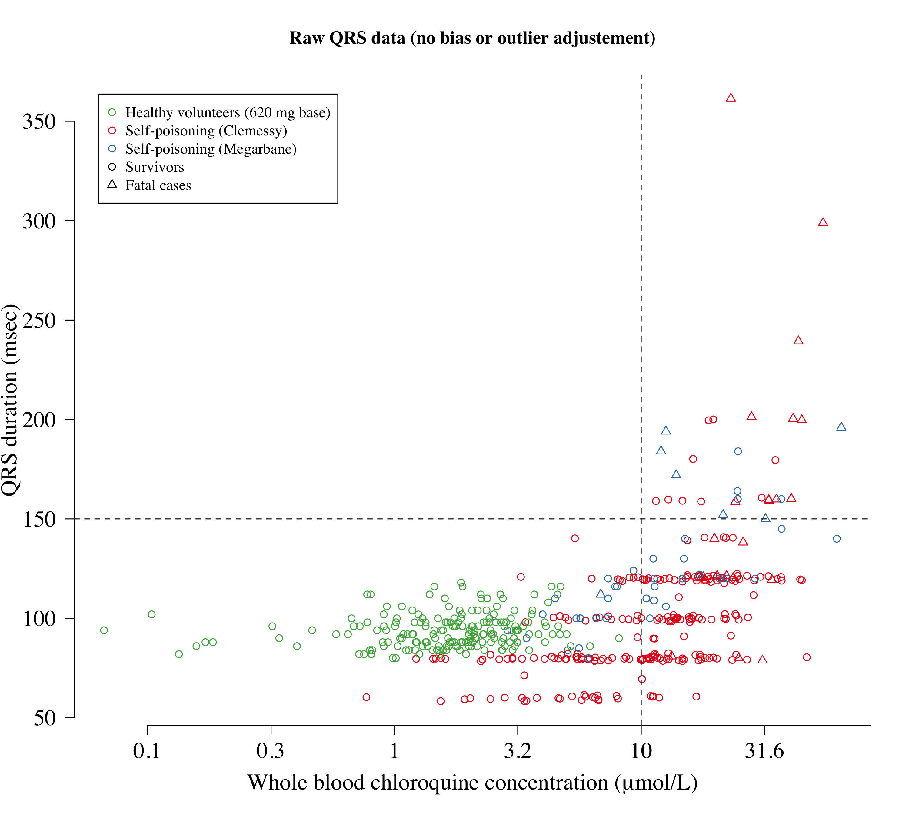

## Data from self-poisoning cohorts and healthy volunteers

Data from Riou were extracted from published graph (see Figure 3 in NEJM Riou et al, 1988) using WebPlotDigitiser


```r
pooled_data = read.csv('Pooled_QRS_data.csv')

# do the conversion from plasma to whole blood for the healthy volunteers
pooled_data$CQ_uMol[pooled_data$study==2] =
  pooled_data$CQ_uMol[pooled_data$study==2]*plasma_to_whole_blood_ratio
```


```r
col_study = RColorBrewer::brewer.pal(n = 3, name = 'Set1')[c(1,3)]

ind_clem = pooled_data$study==1
ys = rep(0, nrow(pooled_data)); ys[ind_clem] = rnorm(sum(ind_clem),mean = 0,sd = 1)
par(las=1, bty='n', family='serif',cex.lab=1.5, cex.axis=1.5)
plot(log10(pooled_data$CQ_uMol), ys+pooled_data$QRS, xaxt='n',
     col = col_study[pooled_data$study], ylab='QRS duration (msec)', 
     xlab=expression(paste('Whole blood chloroquine concentration (',mu,'mol/L)')), 
     pch = pooled_data$died+1,main='Raw QRS data (no bias or outlier adjustement)')
axis(1, at = seq(-1, 2, by = 0.5), labels = round(10^seq(-1, 2, by = 0.5),1))
legend('topleft',  pch = c(1,1,1,1,2),
       legend = c('Healthy volunteers (600 mg base)','Clemessy',
                  'Megarbane','Survivors','Fatal cases'),
       col = c(col_study[c(3,1,2)],'black','black'), inset = 0.03)
abline(h=150, v=1, lty=2)
```

<!-- -->


## Stan model

Emax type model


```r
Conc_QRS_Emax = "
functions {
  real sigmoid(real log10_conc, real ed50, real log_slope, real max_effect, real min_effect){
    return max_effect + (min_effect-max_effect)/(1 + exp(exp(log_slope)*(log10_conc-ed50)));
  }
}

data {
  int<lower=0> N;
  real log10_conc[N];
  real QRS[N];
  int<lower=1,upper=2> study[N]; // 1 is self-poisoning; 2 is healthy volunteers
  real ed50_mu;
  real max_effect_prior_mu;
  real max_effect_prior_sd;
  real min_effect_prior_mu;
  real min_effect_prior_sd;
  real log_slope_prior_mu;
  real log_slope_prior_sd;
}

parameters {
  real log_slope;
  real min_effect;  
  real max_effect;
  real bias_term;
  real ed50;
  real<lower=0> sigma1;
  real<lower=0> sigma2;
}

model {
  // Prior
  bias_term ~ normal(-20,10);
  log_slope ~ normal(log_slope_prior_mu, log_slope_prior_sd);
  ed50 ~ normal(ed50_mu, 1);
  max_effect ~ normal(max_effect_prior_mu,max_effect_prior_sd);
  min_effect ~ normal(min_effect_prior_mu,min_effect_prior_sd);
  
  sigma1 ~ normal(25,5);
  sigma2 ~ normal(7,3);
  
  // Likelihood
  for (j in 1:N){
    real QRS_pred;
    QRS_pred = sigmoid(log10_conc[j], ed50, log_slope, max_effect, min_effect);
    if(study[j] == 1){
      QRS[j] ~ normal(QRS_pred + bias_term, sigma1);
    } else {
      QRS[j] ~ normal(QRS_pred, sigma2);
    }
  }
}
"
if(RUN_MODELS) conc_QRS_mod = stan_model(model_code = Conc_QRS_Emax)
```

## Fit main model to prospective data


```r
sigmoid = function(log10_conc, ed50, log_slope, max_effect, min_effect){
  return (max_effect + (min_effect-max_effect)/(1 + exp(exp(log_slope)*(log10_conc-ed50))))
}
thetas = extract(mod_QRS_full)


xs1 = seq(0,2,length.out = 100)
ys1 = array(dim = c(100,length(thetas$log_slope)))

xs2 = seq(-1,1,length.out = 100)
ys2 = array(dim = c(100,length(thetas$log_slope)))

xs3 = seq(-1,2,length.out = 100)
ys3 = array(dim = c(100,length(thetas$log_slope)))
for(i in 1:length(thetas$log_slope)){
  ys1[,i] = sigmoid(log10_conc = xs1, ed50 = (thetas$ed50[i]),
                   log_slope = (thetas$log_slope[i]),
                   max_effect = (thetas$max_effect[i]), 
                   min_effect = (thetas$min_effect[i])) + 
    rnorm(1,0,thetas$sigma1[i])
  
  ys2[,i] = sigmoid(log10_conc = xs2, ed50 = (thetas$ed50[i]),
                   log_slope = (thetas$log_slope[i]),
                   max_effect = (thetas$max_effect[i]), 
                   min_effect = (thetas$min_effect[i])) + 
    rnorm(1,0,thetas$sigma2[i])
  
  ys3[,i] = sigmoid(log10_conc = xs3, ed50 = (thetas$ed50[i]),
                   log_slope = (thetas$log_slope[i]),
                   max_effect = (thetas$max_effect[i]), 
                   min_effect = (thetas$min_effect[i])) 
}

par(las=1, bty='n', family='serif',cex.lab=1.5, cex.axis=1.5)
jitter_QRS = rnorm(nrow(pooled_data), mean = , sd = 1*as.numeric(pooled_data$study==1))
plot(x = log10(pooled_data$CQ_uMol), panel.first = grid(),
     y = pooled_data$QRS - mean(thetas$bias_term)*as.numeric(pooled_data$study==1) + jitter_QRS, 
     xaxt='n', col = col_study[pooled_data$study],ylab='QRS duration (msec)', 
     xlab=expression(paste('Whole blood chloroquine concentration (',mu,'mol/L)')), 
     pch = pooled_data$died+1, xlim = c(-1,2))
axis(1, at = seq(-1, 2, by = 0.5), labels = round(10^seq(-1, 2, by = 0.5),1))
legend('topleft',  pch = c(1,1,1,2),
       legend = c('Healthy volunteers (600 mg base)',
                  'Self-poisoning',
                  'Survivors','Fatal cases'),
       col = c(col_study[c(2,1)],'black','black'), inset = 0.03)
qs=quantile(pooled_data$QRS[pooled_data$CQ_uMol==0], probs = c(0.025,0.975,0.5))
polygon(x = c(-3,3,3,-3),y = c(qs[1],qs[1],qs[2],qs[2]), 
        col = adjustcolor('grey',alpha.f = .4),border = NA)

abline(h=150, v=1, lty=2)
lines(xs3,rowMeans(ys3),lwd=3)

lines(xs1,apply(ys1,1,quantile,probs=0.025),lwd=2,lty=2, col=col_study[1])
lines(xs1,apply(ys1,1,quantile,probs=0.975),lwd=2,lty=2, col=col_study[1])

lines(xs2,apply(ys2,1,quantile,probs=0.025),lwd=2,lty=2, col=col_study[2])
lines(xs2,apply(ys2,1,quantile,probs=0.975),lwd=2,lty=2, col=col_study[2])


abline(h=qs[3], lty=1, col='grey',lwd=3)

points(log10(pooled_data$CQ_uMol), 
       pooled_data$QRS - mean(thetas$bias_term)*as.numeric(pooled_data$study==1)+jitter_QRS, 
       col = col_study[pooled_data$study],  pch = pooled_data$died+1)
```

<!-- -->


```r
par(mfrow=c(3,2),las=1, cex.lab=1.5)
hist(thetas$max_effect, freq = F,breaks = 50,main = '', 
     xlab = 'Mean upper QRS value', col = 'grey',ylab='', yaxt='n')
xs = seq(min(thetas$max_effect), max(thetas$max_effect), length.out=500)
lines(xs, dnorm(xs, mean = prior_params$max_effect_prior_mu, 
                sd = prior_params$max_effect_prior_sd), lwd=3, col='red')

hist(thetas$min_effect, freq = F,breaks = 50, main = '', 
     xlab = 'Mean lower QRS value', col = 'grey',ylab='', yaxt='n')
xs = seq(min(thetas$min_effect), max(thetas$min_effect), length.out=500)
lines(xs, dnorm(xs, mean = prior_params$min_effect_prior_mu, 
                sd = prior_params$min_effect_prior_sd), lwd=3, col='red')

hist(thetas$bias_term,freq=F,breaks = 50,main = '', xlab = 'Bias term (Clemessy series)', 
     col = 'grey',ylab='', yaxt='n')
xs = seq(min(thetas$bias_term), max(thetas$bias_term), length.out=500)
lines(xs, dnorm(xs, mean = -20, sd = 10), lwd=3, col='red')

hist(thetas$ed50, freq=F,breaks = 50,main = '', xlab = 'ED_50', col = 'grey',
     ylab='', yaxt='n')
xs=seq(0,2,length.out = 2000); 
lines(xs, dnorm(xs,mean = prior_params$ed50_mu,sd = 1),col='red',lwd=3)

hist(thetas$sigma1, freq=F,breaks = 50,main = '', xlab = 'Sigma 1', col = 'grey',
     ylab='', yaxt='n')
xs=seq(0,50,length.out = 500); 
lines(xs, dnorm(xs,mean=25, sd=5),col='red',lwd=3)

hist(thetas$sigma2, freq=F,breaks = 50,main = '', xlab = 'Sigma 2', col = 'grey',
     ylab='', yaxt='n')
lines(xs, dnorm(xs,mean=7, sd=3),col='red',lwd=3)
```

<!-- -->


```r
pooled_data = dplyr::filter(pooled_data, study==1)
table( (pooled_data$QRS-mean(thetas$bias_term)*as.numeric(pooled_data$study==1)) > 150, pooled_data$CQ_uMol>10)
```

```
##        
##         FALSE TRUE
##   FALSE    89  129
##   TRUE      1   27
```

```r
mod=glm(died ~ log(CQ_uMol) + QRS, family = binomial, data = pooled_data)
summary(mod)
```

```
## 
## Call:
## glm(formula = died ~ log(CQ_uMol) + QRS, family = binomial, data = pooled_data)
## 
## Deviance Residuals: 
##      Min        1Q    Median        3Q       Max  
## -1.52305  -0.35649  -0.18333  -0.06684   2.91702  
## 
## Coefficients:
##                Estimate Std. Error z value Pr(>|z|)    
## (Intercept)  -11.661419   1.999345  -5.833 5.46e-09 ***
## log(CQ_uMol)   2.350806   0.652758   3.601 0.000317 ***
## QRS            0.022706   0.008044   2.823 0.004761 ** 
## ---
## Signif. codes:  0 '***' 0.001 '**' 0.01 '*' 0.05 '.' 0.1 ' ' 1
## 
## (Dispersion parameter for binomial family taken to be 1)
## 
##     Null deviance: 157.29  on 245  degrees of freedom
## Residual deviance: 101.16  on 243  degrees of freedom
## AIC: 107.16
## 
## Number of Fisher Scoring iterations: 7
```

```r
writeLines(sprintf('The odds ratio is %s', round(exp(10*0.022706),1)))
```

```
## The odds ratio is 1.3
```

