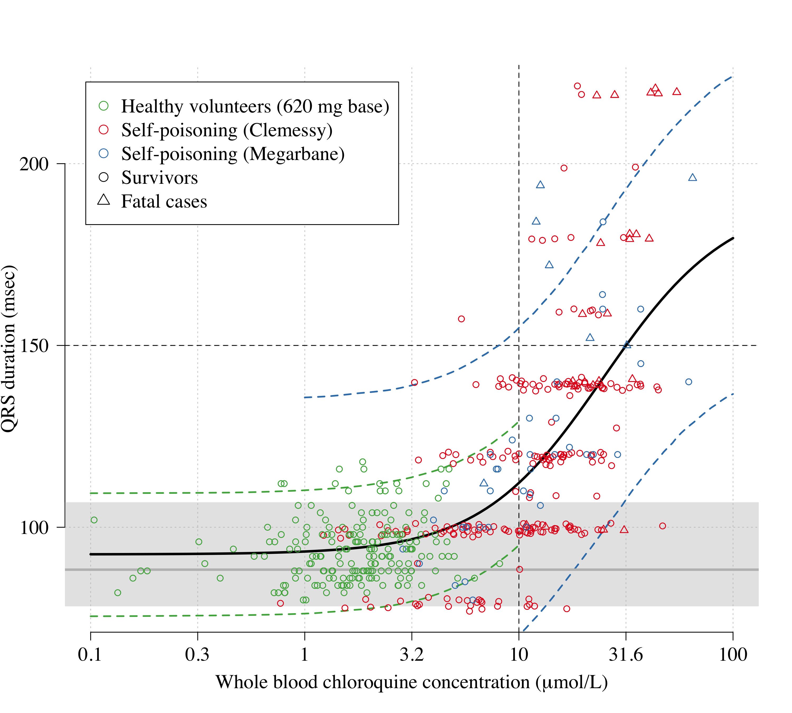

Show R version and package versions

```r
sessionInfo()
```

```
## R version 4.0.0 (2020-04-24)
## Platform: x86_64-apple-darwin17.0 (64-bit)
## Running under: macOS Catalina 10.15.2
## 
## Matrix products: default
## BLAS:   /Library/Frameworks/R.framework/Versions/4.0/Resources/lib/libRblas.dylib
## LAPACK: /Library/Frameworks/R.framework/Versions/4.0/Resources/lib/libRlapack.dylib
## 
## locale:
## [1] en_US.UTF-8/en_US.UTF-8/en_US.UTF-8/C/en_US.UTF-8/en_US.UTF-8
## 
## attached base packages:
## [1] stats     graphics  grDevices utils     datasets  methods   base     
## 
## other attached packages:
## [1] RColorBrewer_1.1-2 rstan_2.19.3       ggplot2_3.3.0      StanHeaders_2.19.2
## [5] gtools_3.8.2       knitr_1.28        
## 
## loaded via a namespace (and not attached):
##  [1] Rcpp_1.0.4.6       pillar_1.4.4       compiler_4.0.0     prettyunits_1.1.1 
##  [5] tools_4.0.0        digest_0.6.25      pkgbuild_1.0.8     evaluate_0.14     
##  [9] lifecycle_0.2.0    tibble_3.0.1       gtable_0.3.0       pkgconfig_2.0.3   
## [13] rlang_0.4.6        cli_2.0.2          parallel_4.0.0     yaml_2.2.1        
## [17] xfun_0.13          loo_2.2.0          gridExtra_2.3      withr_2.2.0       
## [21] stringr_1.4.0      dplyr_0.8.5        vctrs_0.3.0        stats4_4.0.0      
## [25] grid_4.0.0         tidyselect_1.1.0   glue_1.4.1         inline_0.3.15     
## [29] R6_2.4.1           processx_3.4.2     fansi_0.4.1        rmarkdown_2.1     
## [33] purrr_0.3.4        callr_3.4.3        magrittr_1.5       matrixStats_0.56.0
## [37] ps_1.3.3           scales_1.1.1       ellipsis_0.3.1     htmltools_0.4.0   
## [41] assertthat_0.2.1   colorspace_1.4-1   stringi_1.4.6      munsell_0.5.0     
## [45] crayon_1.3.4
```

Important parameters for the analysis/visualisation

```r
#****** Parameters for the analysis *******
plasma_to_whole_blood_ratio = 4 # conversion from plasma to whole blood for the healthy volunteer concentration data
Weight_interested = 70 # displays results for chosen weight - has to be multiple of 5 and between 40 and 90!
```

## Data from self-poisoning cohorts and healthy volunteers

Data from Riou were extracted from published graph (see Figure 3 in NEJM Riou et al, 1988) using WebPlotDigitiser


```r
pooled_data = read.csv('Pooled_QRS_data.csv')

# do the conversion from plasma to whole blood for the healthy volunteers
# study = 1 is self-poisoning
# study = 2 is healthy volunteers
pooled_data$CQ_uMol[pooled_data$study==2] =
  pooled_data$CQ_uMol[pooled_data$study==2]*plasma_to_whole_blood_ratio
```


```r
# some nice colors for the plots
col_study = RColorBrewer::brewer.pal(n = 3, name = 'Set1')[c(1,3)]

ind_clem = pooled_data$study==1
# jitter the self-poisoning QRS data
ys = rep(0, nrow(pooled_data)); ys[ind_clem] = rnorm(sum(ind_clem),mean = 0,sd = 1)

par(las=1, bty='n', family='serif',cex.lab=1.5, cex.axis=1.5)
plot(log10(pooled_data$CQ_uMol), ys+pooled_data$QRS, xaxt='n',
     col = col_study[pooled_data$study], ylab='QRS duration (msec)', 
     xlab=expression(paste('Whole blood chloroquine concentration (',mu,'mol/L)')), 
     pch = pooled_data$died+1,main='Raw QRS data (no bias or outlier adjustement)')
axis(1, at = seq(-1, 2, by = 0.5), labels = round(10^seq(-1, 2, by = 0.5),1))
legend('topleft',  pch = c(1,1,1,2),
       legend = c('Healthy volunteers (620 mg base)','Clemessy',
                  'Survivors','Fatal cases'),
       col = c(col_study[c(2,1)],'black','black'), inset = 0.03)
abline(h=150, v=1, lty=2)
```

<!-- -->


## Stan model

Emax type model


```r
Conc_QRS_Emax = "
functions {
  real sigmoid(real log10_conc, real ed50, real log_slope, real max_effect, real min_effect){
    return max_effect + (min_effect-max_effect)/(1 + exp(exp(log_slope)*(log10_conc-ed50)));
  }
}

data {
  int<lower=0> N1; // number of paired concentration-QRS datapoints
  int<lower=0> N2; // number of QRS datapoints in absence of drug for healthy volunteers
  int<lower=0> N_HV; // the number of healthy volunteers 
  int<lower=0,upper=N_HV> ID1[N1]; // for the interindividual variability - zero is dummy value
  int<lower=0,upper=N_HV> ID2[N2]; // for the interindividual variability - zero is dummy value
  real log10_conc[N1];
  real QRS_drug[N1];
  real QRS_nodrug[N2];
  int<lower=1,upper=2> study[N1]; // 1 is self-poisoning; 2 is healthy volunteers
  
  // prior parameters
  real ed50_mu;
  real ed50_sd;
  real max_effect_prior_mu;
  real max_effect_prior_sd;
  real min_effect_prior_mu;
  real min_effect_prior_sd;
  real log_slope_prior_mu;
  real log_slope_prior_sd;
  real bias_term_prior_mu;
  real bias_term_prior_sd;
  real mu_normal_mean;
  real mu_normal_sd;
  real sigma_i_prior;
}

parameters {
  real log_slope;
  real min_effect;  
  real max_effect;
  real bias_term;
  real ed50;
  real mu_i[N_HV];
  real mu_normal; // the value min_effect - mu_normal is mean normal QRS value
  real<lower=0> sigma1;
  real<lower=0> sigma2;
  real<lower=0> sigma_i; // for inter-individual variability in healthy volunteers
}

model {
  // Prior
  bias_term ~ normal(bias_term_prior_mu,bias_term_prior_sd);
  log_slope ~ normal(log_slope_prior_mu, log_slope_prior_sd);
  ed50 ~ normal(ed50_mu, ed50_sd);
  max_effect ~ normal(max_effect_prior_mu,max_effect_prior_sd);
  min_effect ~ normal(min_effect_prior_mu,min_effect_prior_sd);
  mu_i ~ normal(0,sigma_i);
  mu_normal ~ normal(mu_normal_mean,mu_normal_sd);
  
  sigma_i ~ exponential(sigma_i_prior); // prior standard deviation is +/- 5 msec of IIV
  sigma1 ~ normal(25,5);
  sigma2 ~ normal(2,1);
  
  // Likelihood
  for (j in 1:N1){
    real QRS_pred;
    QRS_pred = sigmoid(log10_conc[j], ed50, log_slope, max_effect, min_effect);
    if(study[j] == 1){
      QRS_drug[j] ~ normal(QRS_pred + bias_term, sigma1);
    } else {
      QRS_drug[j] ~ normal(QRS_pred + mu_i[ID1[j]], sigma2);
    }
  }
  for (j in 1:N2){
    QRS_nodrug[j] ~ normal(min_effect - mu_normal + mu_i[ID2[j]], sigma2);
  }
}
"
if(RUN_MODELS) conc_QRS_mod = stan_model(model_code = Conc_QRS_Emax)
```

## Fit main model to prospective data


```r
N_iter = 10^5
N_thin = 100
N_chains = 8
#options(mc.cores = N_chains) - broken in current R version!
prior_params = list(max_effect_prior_mu = 180,
                    max_effect_prior_sd = 10, 
                    min_effect_prior_mu = 90,
                    min_effect_prior_sd = 4,
                    log_slope_prior_mu = 1,
                    log_slope_prior_sd = 1,
                    ed50_mu = 1.3, 
                    ed50_sd = 1,
                    bias_term_prior_mu = -20,
                    bias_term_prior_sd = 5,
                    mu_normal_mean = 3,
                    mu_normal_sd = 1,
                    sigma_i_prior = 0.2)

# QRS values above 200 are not physiologically possible so we truncate at 200
pooled_data$QRS[pooled_data$QRS > 200] = 200
# only use the non-zero concentration-QRS datapoints
ind_notinf = pooled_data$CQ_uMol > 0 

CQ_data = list(N1 = as.integer(sum(ind_notinf)),
               N2 = as.integer(sum(!ind_notinf)),
               log10_conc = log10(pooled_data$CQ_uMol[ind_notinf]),
               QRS_drug = pooled_data$QRS[ind_notinf],
               QRS_nodrug = pooled_data$QRS[!ind_notinf],
               study = as.integer(pooled_data$study[ind_notinf]),
               ID1 = as.integer(pooled_data$ID[ind_notinf]),
               ID2 = as.integer(pooled_data$ID[!ind_notinf]),
               N_HV = as.integer(max(pooled_data$ID)))

if(RUN_MODELS){
  mod_QRS_full = sampling(conc_QRS_mod,
                          data=c(CQ_data, prior_params),
                          iter = N_iter, thin = N_thin, chains = N_chains)
  save(mod_QRS_full, file = 'mod_QRS_full.stanout')
} else {
  load('mod_QRS_full.stanout')
}
```


```r
sigmoid = function(log10_conc, ed50, log_slope, max_effect, min_effect){
  return (max_effect + (min_effect-max_effect)/(1 + exp(exp(log_slope)*(log10_conc-ed50))))
}
thetas = extract(mod_QRS_full)

xs1 = seq(0,2,length.out = 100)
ys1 = array(dim = c(100,length(thetas$log_slope)))

xs2 = seq(-1,1,length.out = 100)
ys2 = array(dim = c(100,length(thetas$log_slope)))

xs3 = seq(-1,2,length.out = 100)
ys3 = array(dim = c(100,length(thetas$log_slope)))
for(i in 1:length(thetas$log_slope)){
  ys1[,i] = sigmoid(log10_conc = xs1, ed50 = (thetas$ed50[i]),
                   log_slope = (thetas$log_slope[i]),
                   max_effect = (thetas$max_effect[i]), 
                   min_effect = (thetas$min_effect[i])) + 
    rnorm(1,0,thetas$sigma1[i])
  
  ys2[,i] = sigmoid(log10_conc = xs2, ed50 = (thetas$ed50[i]),
                   log_slope = (thetas$log_slope[i]),
                   max_effect = (thetas$max_effect[i]), 
                   min_effect = (thetas$min_effect[i])) + 
    rnorm(1,0,thetas$sigma2[i]) + rnorm(1,0,thetas$sigma_i)
  
  ys3[,i] = sigmoid(log10_conc = xs3, ed50 = (thetas$ed50[i]),
                   log_slope = (thetas$log_slope[i]),
                   max_effect = (thetas$max_effect[i]), 
                   min_effect = (thetas$min_effect[i])) 
}
```


```r
par(las=1, bty='n', family='serif',cex.lab=1.5, cex.axis=1.5)

# random jitter for visualisation
jitter_QRS = rnorm(nrow(pooled_data), mean = , sd = 1*as.numeric(pooled_data$study==1))
plot(x = log10(pooled_data$CQ_uMol), panel.first = grid(),
     y = pooled_data$QRS - mean(thetas$bias_term)*as.numeric(pooled_data$study==1) + jitter_QRS, 
     xaxt='n', col = col_study[pooled_data$study],ylab='QRS duration (msec)', 
     xlab=expression(paste('Whole blood chloroquine concentration (',mu,'mol/L)')), 
     pch = pooled_data$died+1, xlim = c(-1,2))
axis(1, at = seq(-1, 2, by = 0.5), labels = round(10^seq(-1, 2, by = 0.5),1))
legend('topleft',  pch = c(1,1,1,2),
       legend = c('Healthy volunteers (620 mg base)',
                  'Self-poisoning',
                  'Survivors','Fatal cases'),
       col = c(col_study[c(2,1)],'black','black'), inset = 0.03)

QRS_normal = array(dim = max(pooled_data$ID))
for(i in 1:max(pooled_data$ID)){
  # Take the mean of duplicated normal QRS values in the healthy volunteers
  QRS_normal[i] = mean(pooled_data$QRS[pooled_data$CQ_uMol==0 & pooled_data$ID==i])
}
# then we look at quantiles of these 16 datapoints
qs=quantile(QRS_normal, probs = c(0,1,0.5))

qrs_normal_estimated = mean(thetas$min_effect) + colMeans(thetas$mu_i) - mean(thetas$mu_normal)
qs_estimated = quantile(qrs_normal_estimated, probs = c(0,1,0.5))
polygon(x = c(-3,3,3,-3),y = c(qs_estimated[1],qs_estimated[1],qs_estimated[2],qs_estimated[2]), 
        col = adjustcolor('grey',alpha.f = .4),border = NA)

abline(h=150, v=1, lty=2)
lines(xs3,rowMeans(ys3),lwd=3)

lines(xs1,apply(ys1,1,quantile,probs=0.025),lwd=2,lty=2, col=col_study[1])
lines(xs1,apply(ys1,1,quantile,probs=0.975),lwd=2,lty=2, col=col_study[1])

lines(xs2,apply(ys2,1,quantile,probs=0.025),lwd=2,lty=2, col=col_study[2])
lines(xs2,apply(ys2,1,quantile,probs=0.975),lwd=2,lty=2, col=col_study[2])


abline(h=qs_estimated[3], lty=1, col='grey',lwd=3)

points(log10(pooled_data$CQ_uMol), 
       pooled_data$QRS - mean(thetas$bias_term)*as.numeric(pooled_data$study==1)+jitter_QRS, 
       col = col_study[pooled_data$study],  pch = pooled_data$died+1)
```

<!-- -->

```r
# The prolongation from normal to E_min
quantile(thetas$mu_normal, probs = c(0.025,.5,0.975))
```

```
##     2.5%      50%    97.5% 
## 1.622899 2.792322 3.915087
```

Increase in QRS at 3 umol/L

```r
vals = array(dim = length(thetas$log_slope))
for(i in 1:length(thetas$log_slope)){
  vals[i] = sigmoid(log10_conc = log10(3), ed50 = thetas$ed50[i], log_slope = thetas$log_slope[i],
          min_effect = thetas$min_effect[i], max_effect = thetas$max_effect[i]) -
    (thetas$min_effect[i] - thetas$mu_normal[i])
}
hist(vals, xlab='Estimated mean QRS widening at 3 umol/L (msec)',main='', yaxt='n',ylab='')
```

<!-- -->

```r
writeLines(sprintf('At 3umol/L the median increase in QRS is %s (95%% CI is %s - %s)',
                   round(median(vals),1), round(quantile(vals,0.025),1), round(quantile(vals,0.975),1)))
```

```
## At 3umol/L the median increase in QRS is 6.6 (95% CI is 5.5 - 7.8)
```


```r
par(mfrow=c(3,3),las=1, cex.lab=1)
hist(thetas$max_effect, freq = F,breaks = 50,main = '', 
     xlab = 'Emax QRS (msec)', col = 'grey',ylab='', yaxt='n')
xs = seq(min(thetas$max_effect), max(thetas$max_effect), length.out=500)
lines(xs, dnorm(xs, mean = prior_params$max_effect_prior_mu, 
                sd = prior_params$max_effect_prior_sd), lwd=3, col='red')

hist(thetas$min_effect, freq = F,breaks = 50, main = '', 
     xlab = 'Emin QRS (msec)', col = 'grey',ylab='', yaxt='n')
xs = seq(min(thetas$min_effect), max(thetas$min_effect), length.out=500)
lines(xs, dnorm(xs, mean = prior_params$min_effect_prior_mu, 
                sd = prior_params$min_effect_prior_sd), lwd=3, col='red')

hist(thetas$bias_term,freq=F,breaks = 50,main = '', xlab = 'Bias term (Clemessy, msec)', 
     col = 'grey',ylab='', yaxt='n')
xs = seq(min(thetas$bias_term), max(thetas$bias_term), length.out=500)
lines(xs, dnorm(xs, mean = prior_params$bias_term_prior_mu, sd = prior_params$bias_term_prior_sd), lwd=3, col='red')

hist(thetas$ed50, freq=F,breaks = 50,main = '', xlab = 'ED_50 (log_10 concentration)', col = 'grey',
     ylab='', yaxt='n')
xs=seq(0,2,length.out = 2000); 
lines(xs, dnorm(xs,mean = prior_params$ed50_mu,sd = prior_params$ed50_sd),col='red',lwd=3)

hist(thetas$log_slope, freq=F,breaks = 50,main = '', xlab = 'Slope coefficient (on log scale)', 
     col = 'grey',ylab='', yaxt='n')
xs=seq(0,2,length.out = 2000); 
lines(xs, dnorm(xs,mean = prior_params$log_slope_prior_mu,sd = prior_params$log_slope_prior_sd),
      col='red',lwd=3)


hist(thetas$mu_normal, freq=F,breaks = 50,main = '', 
     xlab = 'Decrease for steady state QRS (msec)', col = 'grey', ylab='', yaxt='n')
xs=seq(0,10,length.out = 500); 
lines(xs, dnorm(xs,mean = prior_params$mu_normal_mean,sd = prior_params$mu_normal_sd),col='red',lwd=3)

hist(thetas$sigma1, freq=F,breaks = 50,main = '', xlab = 'Sigma self-poisoning', 
     col = 'grey',ylab='', yaxt='n')
xs=seq(0,50,length.out = 500); 
lines(xs, dnorm(xs,mean = 25, sd = 5),col='red',lwd=3)

hist(thetas$sigma2, freq=F,breaks = 50,main = '', xlab = 'Sigma healthy volunteers', 
     col = 'grey',  ylab='', yaxt='n')
lines(xs, dnorm(xs,mean = 2, sd = 1),col='red',lwd=3)

hist(thetas$sigma_i, freq=F,breaks = 50,main = '', 
     xlab = 'Inter-individual sigma (healthy volunteers)', col = 'grey',
     ylab='', yaxt='n')
lines(xs, dexp(xs,rate = prior_params$sigma_i_prior),col='red',lwd=3)
```

<!-- -->


```r
pooled_data = dplyr::filter(pooled_data, study==1)
table( (pooled_data$QRS-mean(thetas$bias_term)*as.numeric(pooled_data$study==1)) > 150, pooled_data$CQ_uMol>10)
```

```
##        
##         FALSE TRUE
##   FALSE    89  129
##   TRUE      1   27
```

```r
mod=glm(died ~ log(CQ_uMol) + QRS, family = binomial, data = pooled_data)
summary(mod)
```

```
## 
## Call:
## glm(formula = died ~ log(CQ_uMol) + QRS, family = binomial, data = pooled_data)
## 
## Deviance Residuals: 
##      Min        1Q    Median        3Q       Max  
## -1.52305  -0.35649  -0.18333  -0.06684   2.91702  
## 
## Coefficients:
##                Estimate Std. Error z value Pr(>|z|)    
## (Intercept)  -11.661419   1.999345  -5.833 5.46e-09 ***
## log(CQ_uMol)   2.350806   0.652758   3.601 0.000317 ***
## QRS            0.022706   0.008044   2.823 0.004761 ** 
## ---
## Signif. codes:  0 '***' 0.001 '**' 0.01 '*' 0.05 '.' 0.1 ' ' 1
## 
## (Dispersion parameter for binomial family taken to be 1)
## 
##     Null deviance: 157.29  on 245  degrees of freedom
## Residual deviance: 101.16  on 243  degrees of freedom
## AIC: 107.16
## 
## Number of Fisher Scoring iterations: 7
```

```r
writeLines(sprintf('The odds ratio is %s', round(exp(10*0.022706),1)))
```

```
## The odds ratio is 1.3
```

