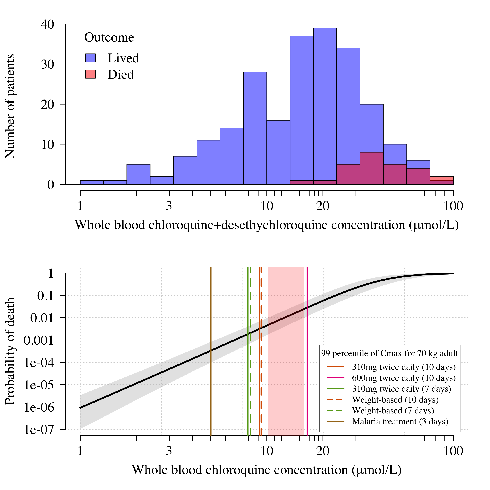

# Chloroquine-concentration-fatality

This code does two things, bundled up as an RMarkdown file. 

First it fits a Bayesian logistic regression model to pooled patient data from self-poisoning studies (see pooled_data.csv). The final model uses all the prospectively studied patients (n=258) as there is significant bias in the retrospectively studies patients. It also uses whole blood chloroquine concentrations measured on admission (no change when using observed peak concentrations in individuals with multiple measurements).

Second, it uses output Cmax distributions from one of two population pharmacokinetic models (written and fitted in NONMEM) to estimate the risk of fatal overdose under a set of chloroquine treatment regimens (5 regimens for COVID-19 and one malaria regimen).

## Main Result

Pooled data from self-poisoning cohorts in France (Figure below, top panel) and the estimated relationship between peak chloroquine concentrations and death (bottom panel). In the bottom panel, the vertical redish shaded area is the *danger-zone*: concentrations associated with 1\% mortality. We compared predictions for a set of different chloroquine regimens. The most extreme regimen was the one given in a recent clinical trial in Brazil (Borba et al, MedRxiv). They gave 600mg base twice daily for ten days. This gets a lot of patients into the *danger-zone*.
In comparison, the regimen recommended by the Chinese authorities (310mg base twice daily) is much safer. Malaria regimens don't kill people (at least not more than the expected backgorund rate of death!) and so are completely fine.

## Sensitivity to PK model

We use two PK models, one estimated from data in malaria patients, and one estimated from data in healthy volunteers. The PK profiles are expected to be approximately the same in malaria and non-malaria.
The malaria concentrations were whole blood; the healthy volunteers were plasma. The exact ratio of plasma to whole blood is unknown but it's approximately 3-4 (varies widely across publications, but a meta estimate is about 3.5).

## Assumptions in PD model

The logistic regression models the observed peak concentration data and non-observed differently (add a scaling factor to non-observed peaks). We adjust for the presence of the chloroquine metabolite.
