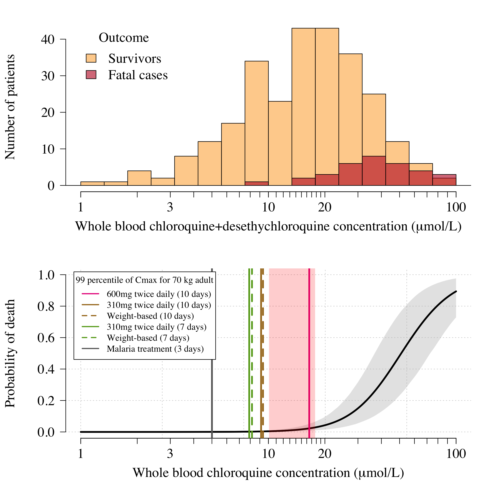

# Chloroquine-concentration-fatality

This code does three things, bundled up as an RMarkdown file. 

First it fits a Bayesian logistic regression model to pooled patient data from self-poisoning studies (see pooled_data.csv). The final model uses all the prospectively studied patients (n=258) as there is significant bias in the retrospectively studies patients. It also uses whole blood chloroquine concentrations measured on admission (no change when using observed peak concentrations in individuals with multiple measurements).

Second, it uses output Cmax distributions from one of two population pharmacokinetic models (written and fitted in NONMEM) to estimate the risk of fatal overdose under a set of chloroquine treatment regimens (5 regimens for COVID-19 and one malaria regimen).

Third, it analyses electrocardiograph QRS durations, pooling data from healthy volunteers and self-poisoning.
QRS prolongation is an independent predictor of mortality and is a good way of characterising whether chloroquine overdose has occured.

## Main Result - chloroquine concentration-dependent mortality

Pooled data from self-poisoning cohorts in France (Figure below, top panel) and the estimated relationship between peak chloroquine concentrations and death (bottom panel). In the bottom panel, the vertical redish shaded area is the *danger-zone*: concentrations associated with 1\% mortality. We compared predictions for a set of different chloroquine regimens. The most extreme regimen was the one given in a recent clinical trial in Brazil (Borba et al, MedRxiv). They gave 600mg base twice daily for ten days. This gets a lot of patients into the *danger-zone*.
In comparison, the regimen recommended by the Chinese authorities (310mg base twice daily) is much safer. Malaria regimens don't kill people (at least not more than the expected background rate of sudden death!) and so are completely fine.

## Main Result - chloroquine concentration-dependent QRS widening

Pooling QRS data from healthy volunteers (16 individuals with 13 measurements each) who took 620 mg base single doses of chloroquine, and QRS data from self-poisoning, we can estimate the extent of QRS widening as a function of the whole blood chloroquine concentration. We do this using a fully hierarchical Bayesian model (individual intercept terms for the healthy volunteers who have multiple measurements; different error distributions for the different self-poisoning studies).

## Sensitivity to PK model

We use two PK models, one estimated from data in malaria patients, and one estimated from data in healthy volunteers. The PK profiles are expected to be approximately the same in malaria and non-malaria. The NONMEM sim files are in the folder NONMEM.
The malaria concentrations were whole blood; the healthy volunteers were plasma. The exact ratio of plasma to whole blood is unknown but it's approximately 4 (varies widely across publications, a meta estimate is about 3.5). We use a ratio of 4 but it's a free parameter in the code. Everything can be re-run using any chosen ratio.

## Assumptions in PD model

The logistic regression models the observed peak concentration data and non-observed differently (add a scaling factor to non-observed peaks). We adjust for the presence of the chloroquine metabolite.
