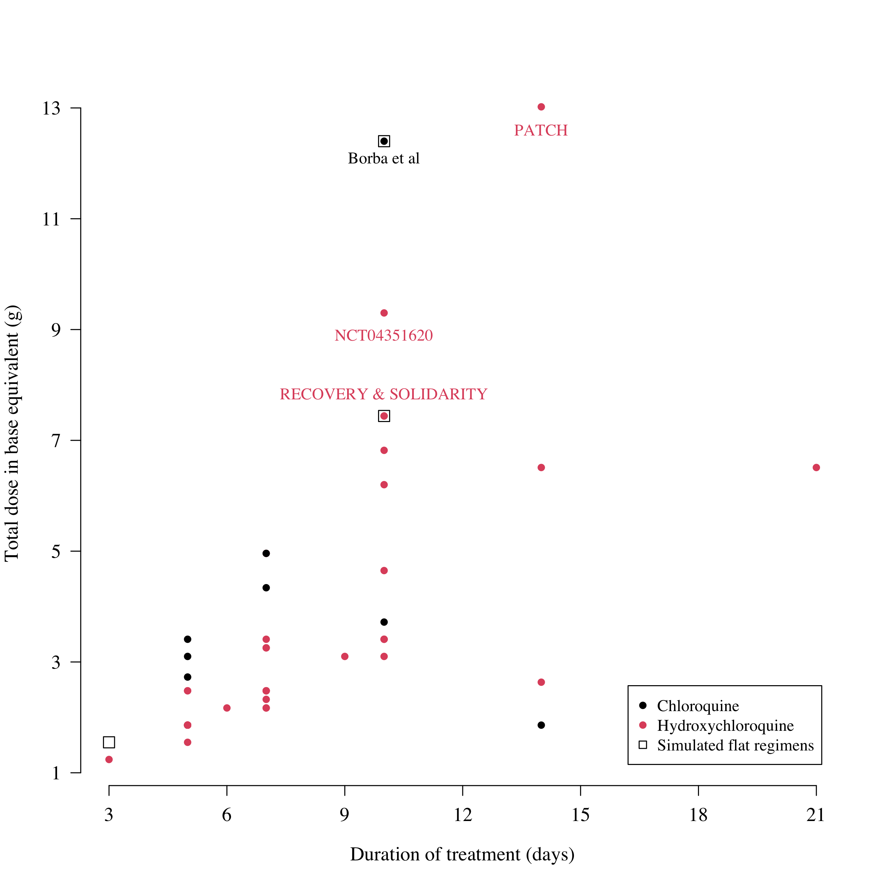

# Chloroquine-concentration-fatality

This code underlies the paper "Concentration-dependent mortality of chloroquine in overdose" [published in eLife](https://elifesciences.org/articles/58631).

The code does three things, bundled up as an RMarkdown file:

* First it fits a Bayesian logistic regression model to pooled patient data from self-poisoning studies (see pooled_data.csv). The final model uses all the prospectively studied patients (n=302) as there is significant bias in the retrospectively studied patients. It uses whole blood chloroquine+metabolite concentrations measured on admission and peak observed concentrations for individuals with multiple measurements.

* Second, it uses output Cmax distributions from one of two population pharmacokinetic models (written, fitted and simulated using NONMEM) to estimate the risk of fatal overdose under a set of chloroquine treatment regimens (5 regimens for COVID-19 and one malaria regimen).

* Third, it analyses electrocardiograph QRS durations, pooling data from healthy volunteers and self-poisoning. QRS prolongation is an independent predictor of mortality and provides a simple approach for determining whether chloroquine overdose has occured.

## Motivation - what is a safe regimen of chloroquine?

In vitro data for SARS-CoV2 suggest that high concentrations of chloroquine/hydroxychloroquine are needed for a reasonable antiviral effect.
This has motivated some clinical trials to give higher dose regimens than usually given in malaria or hepatic amoebiasis.
A review of treatment trials (hospitalised patients) show a very wide variety of dosing strategies:

The question of interest is which of these are safe? What's a reasonable upper limit for chloroquine concentrations?

## Main Result - chloroquine concentration-dependent mortality

We tried to answer this question by pooling data from self-poisoning cohorts in France (Figure below, top panel). The unfortunate experience of self-poisoning allows for a characterisation of the relationship between peak chloroquine concentrations and death (bottom panel). 

In the bottom panel, the vertical redish shaded area is the *danger-zone*: concentrations associated with 1\% mortality. We compared predictions for a set of different chloroquine regimens (shown up empty squares in plot above). The most extreme chloroquine regimen was given in a clinical trial in Brazil ([Borba et al, JAMA Open](https://jamanetwork.com/journals/jamanetworkopen/fullarticle/2765499)). The high dose chloroquine arm gave 600 mg base twice daily for ten days. This gets a lot of patients into the *danger-zone*.
In comparison, the regimen recommended by the Chinese authorities (310 mg base twice daily) with the addition of two loading doses (620 mg) is much safer. This is the regimen used by the large randomised trials RECOVERY and SOLIDARITY.
Malaria regimens don't kill people (at least not more than the expected background rate of sudden death!) and so are completely fine.

## Main Result - chloroquine concentration-dependent QRS widening

Pooling QRS data from healthy volunteers (16 individuals with 13 measurements each) who took 620 mg base single doses of chloroquine, and QRS data from self-poisoning, we can estimate the extent of QRS widening as a function of the whole blood chloroquine concentration. We do this using a fully hierarchical Bayesian model (individual intercept terms for the healthy volunteers who have multiple measurements; different error distributions for the different self-poisoning studies).

## Sensitivity to PK model

We use two PK models, one estimated from data in malaria patients, and one estimated from data in healthy volunteers. The PK profiles are expected to be approximately the same in malaria and non-malaria. The NONMEM sim files are in the folder NONMEM.
The malaria concentrations were whole blood; the healthy volunteers were plasma. The exact ratio of plasma to whole blood is unknown but it's approximately 4 (varies widely across publications, a meta estimate is about 3.5). We use a ratio of 4 but it's a free parameter in the code. Everything can be re-run using any chosen ratio.

## Assumptions in PD model

The logistic regression models the observed peak concentration data and non-observed differently (add a scaling factor to non-observed peaks). We adjust for the presence of the chloroquine metabolite.
